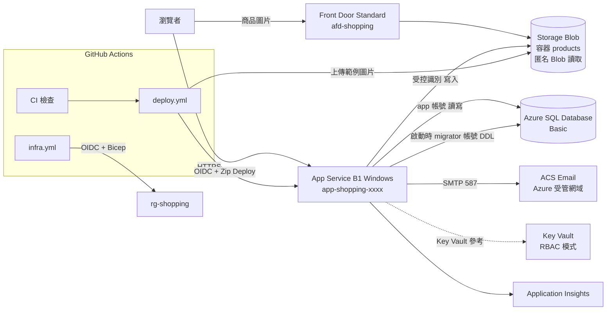

# CI/CD 與 Azure 部署計畫書

> 專案：Shopping Website（ASP.NET Web Forms，.NET Framework 4.7.2，SQL Server）
> Repo：<https://github.com/jeff1121/Shopping-Website>（Public，預設分支 `main`；GitHub 擁有者名稱為小寫 `jeff1121`）
> 文件狀態：**v1.10（決策已確認；M1～M6 已完成，M7 進行中；Azure 一次性設定已完成；進度見 [5. 里程碑總覽](#5-里程碑總覽)）**
> 最後更新：2026-10-01
> 用語定義見 [CONTEXT.md](CONTEXT.md)；關鍵架構決策見 [docs/adr/](docs/adr/)。

---

## 目錄

1. [目標與範圍](#1-目標與範圍)
2. [已確認決策](#2-已確認決策)
3. [現況與限制](#3-現況與限制)
4. [目標架構](#4-目標架構)
5. [里程碑總覽](#5-里程碑總覽)
6. [M1：CI 掃描與 Repo 治理](#6-m1ci-掃描與-repo-治理)
7. [M2：可建置與建置 CI](#7-m2可建置與建置-ci)
8. [M3：設定外部化與程式調整](#8-m3設定外部化與程式調整)
9. [M4：Azure 基礎設施（Bicep）](#9-m4azure-基礎設施bicep)
10. [M5：資料庫 Migration](#10-m5資料庫-migration)
11. [M6：CD 自動部署與部署後驗證](#11-m6cd-自動部署與部署後驗證)
12. [M7：應用程式安全修正](#12-m7應用程式安全修正)
13. [M8：轉入正式營運](#13-m8轉入正式營運)
14. [設定與敏感設定清單](#14-設定與敏感設定清單)
15. [Workflow 檔案總覽](#15-workflow-檔案總覽)
16. [權限矩陣](#16-權限矩陣)
17. [成本估算](#17-成本估算)
18. [風險與對策](#18-風險與對策)
19. [需要您執行或提供的事項](#19-需要您執行或提供的事項)
20. [驗收標準](#20-驗收標準)
21. [修訂紀錄](#21-修訂紀錄)

---

## 1. 目標與範圍

### 目標

1. 以 GitHub Actions 建立 CI：每個 PR 自動建置，並執行 **CodeQL 程式碼品質掃描**、**CodeQL 安全掃描**、**SBOM 產生與漏洞比對**、相依套件審查等檢查。
2. 以 GitHub Actions 建立 CD：合併 `main` 後自動部署到 **Azure App Service**。
3. 以 Bicep 建立全部 Azure 資源（Infrastructure as Code）。
4. 所有**敏感設定**（資料庫帳密、寄信密碼等）不進版控，存放於 **Azure Key Vault**，App Service 以環境變數（Key Vault 參考）讀取；轉入正式營運時只需人工更換 Key Vault 中的值。
5. 商品圖片改存 **Azure Blob Storage**，經 **Azure Front Door** 提供。
6. 轉入正式營運前完成應用程式安全修正。

### 不在本計畫範圍

- 遷移至 ASP.NET Core、Master Page 重構、響應式版面、金流、管理後台。
- M7 以外的功能缺陷修正（列於 README「已知問題與限制」，另案處理）。

### 語言規範

本專案所有文件（含 README）、程式碼註解、Commit 訊息與 PR 訊息一律使用**繁體中文**；程式識別字維持英文。Workflow 的 `name:` 與步驟名稱亦使用繁體中文。

---

## 2. 已確認決策

| # | 主題 | 決策 | 備註 |
| --- | --- | --- | --- |
| D1 | 環境 | **只有一個環境**，先試運行，之後轉入正式營運；不建立獨立的測試環境與正式環境，也不使用 staging slot | [ADR-0001](docs/adr/0001-single-environment.md) |
| D2 | 區域與方案 | **East Asia**；App Service **B1（Windows）**，固定 1 個執行個體 | 正式營運時可線上升級 |
| D3 | 資料庫 | **Azure SQL Database**（Basic），由 Bicep 建立 | |
| D4 | 敏感設定 | 全部放 **Key Vault**，App Service 應用程式設定使用 `@Microsoft.KeyVault(...)` 參考 | |
| D5 | SQL 帳號 | 兩個資料庫使用者：`migrator`（DDL + 讀寫，僅供啟動時 migration）與 `app`（僅讀寫）；由 Bicep `deploymentScript` 建立，密碼自動產生並直接寫入 Key Vault | [ADR-0002](docs/adr/0002-migration-on-app-startup.md) |
| D6 | Schema 部署 | App 啟動時（`Global.asax` 的 `Application_Start`）以 **DbUp** 套用版本化腳本 | [ADR-0002](docs/adr/0002-migration-on-app-startup.md) |
| D7 | 示範資料 | 分類、示範帳號（含賣家）、範例商品**全部放在 migration**；轉入正式營運時以清除腳本人工刪除 | |
| D8 | 商品圖片 | 存 **Azure Blob Storage**；`pimage` 存完整網址；App 以受控識別寫入 | |
| D9 | CDN | **Azure Front Door Standard** 只負責商品圖片；網站本身直接走 `*.azurewebsites.net` | |
| D10 | 寄信 | **Azure Communication Services Email**，使用 Azure 受管網域，透過 SMTP 介接（程式維持 `SmtpClient`） | |
| D11 | Session | 維持 InProc Session，固定 1 個執行個體並啟用 ARR Affinity | |
| D12 | PDF 函式庫 | 沿用 **iTextSharp 5.5.13.x NuGet**（AGPL）；README 註明授權 | [ADR-0003](docs/adr/0003-keep-itextsharp-agpl.md) |
| D13 | Azure 登入 | GitHub Actions 以 **OIDC** 聯合身分登入 Azure，無長期密鑰 | |
| D14 | 基礎設施部署 | `infra.yml`：PR 時執行 `what-if` 預覽，合併 `main` 後自動部署 | |
| D15 | 程式部署 | `main` 受保護、變更一律走 PR；合併後自動部署；轉入正式營運後在 GitHub Environment 開啟人工核准 | |
| D16 | 掃描阻擋 | 試運行：PR 只擋**新增**的 High／Critical 安全警示；既有警示每類開 Issue 追蹤、不 dismiss。M7 完成後改為任何 High／Critical 都擋 | |
| D17 | SBOM | 原始碼與部署套件各一份，SPDX 與 CycloneDX 兩種格式，`attest-sbom` 簽章，Grype 漏洞比對，artifact 保留 90 天，另啟用 GitHub 內建匯出 | |
| D18 | 安全修正 | 新增里程碑 M7，為轉入正式營運的前置條件 | |

---

## 3. 現況與限制

| 項目 | 現況 | 影響 |
| --- | --- | --- |
| 框架 | .NET Framework 4.7.2、舊式 Web Application Project（`Website.csproj`） | CI 必須用 `windows-latest` 與 MSBuild；App Service 必須是 **Windows** |
| 可建置性 | **可在 Windows + MSBuild 編譯與發行**；本機執行仍需填入連線字串 | M2 已完成，PR #9 驗證 `site.zip` 產出 |
| 連線字串 | 12 個後置程式碼以 `Website.Data.Db` 讀取；`Web.config` 以 Configuration Builders 的 `${SQL_*}` 權杖由環境變數代入，版控中沒有任何連線資訊 | M3 已完成；本機與 Azure 都只需設定環境變數 |
| 寄信 | `forgotpass.aspx.cs` 改讀 `SMTP_*` 設定（M3 已完成），M7 PR B 改為寄出一次性重設連結 | 已完成 |
| 圖片上傳 | `addProducts.aspx.cs` 經 `Website.Data.ImageStore` 寫入 Blob，`pimage` 存完整網址（M3 已完成） | Azure 上需 M4 建立 Storage 與 Front Door |
| 預設圖 | `index.aspx` 的 `onerror` 退回 `img/products/human.png` | 此檔必須保留在部署套件中 |
| PDF | `profile.aspx.cs` 以 iTextSharp `HTMLWorker` 將訂單表格轉 PDF，寫入 `Response.OutputStream`；iTextSharp 5.5.13.6 與 BouncyCastle.Cryptography 2.6.2 由 NuGet 還原 | M2 已完成 |
| `Global.asax` | M3 已新增，啟動時檢查設定 | M5 加入啟動 migration |
| 缺少檔案 | `Properties/AssemblyInfo.cs`、`css/style.css` 已補入並列入專案 | M2 已完成 |
| 版控 | 已有 `.gitignore`、`.editorconfig`、`.gitattributes`；`packages/`、`Website/obj/`、`Website.csproj.user` 已移出版控，改由 NuGet 還原 | M1 已完成 |
| Azure | 訂用帳戶 BD-CIS-Testing；`rg-shopping`、OIDC 部署身分、兩個使用者指派受控識別與 GitHub Environment `azure` 已由 `infra/bootstrap.sh` 建立；Owner 受組織 ABAC 條件限制，不能指派高權限角色 | Bicep 不做角色指派（[ADR-0004](docs/adr/0004-pre-provisioned-managed-identities.md)）；M4 尚未開始 |
| 測試 | 無自動化測試 | 以建置成功 + 部署後冒煙測試作為品質閘門 |
| Repo 可見性 | Public | CodeQL、Secret Scanning、Dependency Review、Scorecard **免費可用** |

---

## 4. 目標架構



### Azure 資源清單

所有資源放在同一個 Resource Group `rg-shopping`（East Asia）。名稱中的 `xxxx` 為 Bicep 以 `uniqueString(resourceGroup().id)` 產生的後綴，確保全域唯一。

| 資源 | 名稱 | 規格與設定 |
| --- | --- | --- |
| App Service Plan | `asp-shopping` | Windows、**B1**、1 個執行個體 |
| App Service | `app-shopping-xxxx` | .NET Framework v4.8 執行階段（相容 4.7.2）；`alwaysOn: true`、`httpsOnly: true`、`minTlsVersion: 1.2`、`ftpsState: Disabled`、`clientAffinityEnabled: true`；掛上使用者指派受控識別 `id-shopping-web`，`keyVaultReferenceIdentity` 指向此識別；`WEBSITE_RUN_FROM_PACKAGE=1` |
| Azure SQL 邏輯伺服器 | `sql-shopping-xxxx` | SQL 驗證 + 管理員；防火牆規則「允許 Azure 服務存取」（`0.0.0.0`），供 App Service 與 `deploymentScript` 連線 |
| Azure SQL Database | `sqldb-shopping` | **Basic**（5 DTU、2 GB）；定序 `SQL_Latin1_General_CP1_CI_AS` |
| Key Vault | `kv-shopping-xxxx` | **RBAC 授權模式**、軟刪除、清除保護 |
| Storage Account | `stshoppingxxxx` | StorageV2、LRS；`allowBlobPublicAccess: true`；容器 `products`（存取層級 **Blob**：只能讀單一檔案、不能列出清單） |
| Front Door | `afd-shopping` | **Standard**；端點 `afd-shopping-xxxx.z01.azurefd.net`（實際網址由 Azure 產生）；origin 指向 Blob 主要端點；路由 `/*`，啟用快取與壓縮，僅 HTTPS |
| Communication Service | `acs-shopping-xxxx` | 資料位置 `Asia Pacific` |
| Email Communication Service | `ecs-shopping-xxxx` | Azure 受管網域（`xxxxxxxx.azurecomm.net`），並連結到上方 Communication Service |
| Log Analytics | `log-shopping` | 保留 30 天 |
| Application Insights | `appi-shopping` | Workspace-based |
| 使用者指派受控識別 | `id-shopping-web` | App Service 使用：解析 Key Vault 參考、寫入 Blob |
| 使用者指派受控識別 | `id-shopping-deployscript` | 供 `deploymentScript` 寫入 Key Vault |

> Resource Group、GitHub OIDC 身分（App Registration）與上述兩個使用者指派受控識別**不由 Bicep 建立**，而是由 `infra/bootstrap.sh` 建立一次並完成角色指派（見 [9.4](#94-一次性手動步驟)）；Bicep 以 `existing` 參照受控識別，且**不包含任何角色指派**。

---

## 5. 里程碑總覽

| 里程碑 | 內容 | 前置條件 | 預估工時 | 狀態 |
| --- | --- | --- | --- | --- |
| **M1** CI 掃描與 Repo 治理 | CodeQL、原始碼 SBOM、Dependency Review、Dependabot、Secret Scanning、Scorecard、Lint、`.gitignore`、`.editorconfig`、分支規則 | 無 | 1 天 | ✅ 已完成（PR #1、#3、#8） |
| **M2** 可建置與建置 CI | 補缺檔、iTextSharp 改 NuGet、`build.yml`、部署套件 SBOM | 無（可與 M1 平行） | 1 天 | ✅ 已完成（PR #9、#10） |
| **M3** 設定外部化與程式調整 | Configuration Builders、共用 `Db`／`AppSettings` 類別、12 處連線、SMTP、圖片上傳改 Blob | M2 | 1.5 天 | ✅ 已完成（3-1、3-2 於 M2；其餘於 M3 PR） |
| **M4** Azure 基礎設施 | Bicep 全部資源、`deploymentScript` 建 SQL 使用者、`infra.yml` | 您完成 [9.4](#94-一次性手動步驟) | 1.5 天 | ✅ 已完成（PR #11、#15、#16；ACS SMTP 以 `infra/smtp-setup.sh` 設定） |
| **M5** 資料庫 Migration | `Global.asax` + DbUp、`0001` 起的腳本（含示範資料）、示範資料清除腳本 | M3 | 1 天 | ✅ 已完成（DbUp 啟動時套用 `0001`～`0004`；以 SQL Server 容器驗證首次、重複與手動建表情境） |
| **M6** CD 與部署後驗證 | `deploy.yml`、範例圖片上傳、冒煙測試、ZAP Baseline、可用性監控 | M4、M5 | 1 天 | ✅ 已完成（另修正 M5 migrator 連線字串遺失密碼；App 記錄送 Log Analytics） |
| **M7** 應用程式安全修正 | 參數化查詢、密碼雜湊、重設密碼連結、權限檢查、移除 `static` 共用狀態、上傳驗證 | M6 | 3～5 天 | 🔄 進行中（PR A～C 已完成；PR D 待完成，見 §12） |
| **M8** 轉入正式營運 | 清除示範資料、更換敏感設定、收緊掃描阻擋、開啟部署核准 | M7 | 0.5 天 | ⬜ 未開始 |

---

## 6. M1：CI 掃描與 Repo 治理

### 6.1 CodeQL（`.github/workflows/codeql.yml`）

| 設定 | 值 |
| --- | --- |
| 觸發 | `pull_request`（`main`）、`push`（`main`）、`schedule`（每週一 02:00 台灣時間 = `cron: '0 18 * * 0'` UTC） |
| 語言 | `csharp`、`actions`（同時掃描 workflow 本身） |
| `build-mode` | `none`：C# 不需編譯即可分析，M2 之前就能運作 |
| 查詢集 | `security-and-quality`（涵蓋 `security-extended` 的全部安全查詢，另加程式碼品質查詢） |
| 結果呈現 | GitHub → Security → Code scanning；PR 上顯示新增警示 |
| 權限 | `security-events: write`、`contents: read`、`actions: read` |
| Runner | `ubuntu-latest`（`build-mode: none` 不需要 Windows） |

- **品質掃描**與**安全掃描**來自同一次分析，分別以警示的 `security-severity` 與 `severity` 分類呈現。
- 同時在 Repo 設定啟用 **GitHub Code Quality**（若帳號可用），於 PR 顯示可維護性評分。
- **既有警示處理**：首次掃描後，**安全警示**依 CodeQL 規則（如 `cs/sql-injection`、`cs/web/xss`）每類開一個 Issue，標籤 `security`、`M7`；**品質警示**合併為一個追蹤 Issue（標籤 `quality`、`M7`），逐規則列出數量。一律不 dismiss。

### 6.2 原始碼 SBOM（`.github/workflows/sbom.yml`）

| 步驟 | 工具 | 產出 |
| --- | --- | --- |
| 產生 | `anchore/sbom-action`（Syft），掃描 Repo；Syft 不解析 `packages.config`，NuGet 套件另由 GitHub 相依圖 API（`/dependency-graph/sbom`）取得 | `sbom-source.spdx.json`、`sbom-source.cdx.json`、`sbom-dependency-graph.spdx.json` |
| 漏洞比對 | `anchore/scan-action`（Grype），輸入 SBOM，`severity-cutoff: high`、`fail-build: false`（試運行期間只回報；新增的高風險套件由 Dependency Review 在 PR 阻擋） | SARIF 上傳至 Code scanning（分類 `grype-source`、`grype-nuget`） |
| 簽章 | `actions/attest-sbom`，主體為 `git archive` 產生的 `source-<sha>.tar.gz`（需 `id-token: write`、`attestations: write`） | 可用 `gh attestation verify source-<sha>.tar.gz -R jeff1121/Shopping-Website` 驗證 |
| 保存 | `actions/upload-artifact`，`retention-days: 90` | — |

- 觸發：`push`（`main`）、`pull_request`（僅產生與比對，不簽章）、`workflow_dispatch`。
- 另外在 Repo → Insights → Dependency graph 啟用內建 **Export SBOM**。
- 部署套件 SBOM 見 [7.3](#73-部署套件-sbom)。
- 相依圖 SBOM API 偶爾回傳 HTTP 500；`sbom.yml` 已加入最多 3 次重試。

### 6.3 其他 CI 與治理

| # | 項目 | 檔案／設定 | 內容 |
| --- | --- | --- | --- |
| 1-1 | `.gitignore` | `.gitignore` | Visual Studio 範本；排除 `bin/`、`obj/`、`packages/`、`*.user`、`.vs/`、`secrets.xml` |
| 1-2 | 移出已追蹤的產物 | `git rm -r --cached packages Website/obj Website/Website.csproj.user` | 改由 NuGet 還原；`img/products/human99/laptop.png` 仍保留追蹤（示範圖片） |
| 1-3 | `.editorconfig` | `.editorconfig` | `.cs`、`.aspx`、`.csproj`、`.sln`：`utf-8-bom` + `crlf`；`.config`、`.sql`：`crlf`（不強制 BOM，沿用現況）；上述舊檔不檢查行尾空白與檔尾換行，避免純空白 diff；其餘（`.md`、`.yml`、`.bicep` 等）：`utf-8` + `lf`，全部規則皆檢查 |
| 1-4 | `.gitattributes` | `.gitattributes` | 預設 `text=auto eol=lf`；CRLF 檔案類型設為 `-text`（Git 原樣保存、不轉換，避免整檔改寫）；圖片等設為 `binary` |
| 1-5 | Dependabot | `.github/dependabot.yml` | `nuget`（目錄 `/Website`）與 `github-actions`（目錄 `/`）；每週一；各自合併成一個群組 PR；Commit 前綴為繁中 `相依套件：` |
| 1-6 | Dependency Review | `.github/workflows/dependency-review.yml` | `fail-on-severity: high`；`deny-licenses: GPL-2.0-only, GPL-3.0-only, AGPL-3.0-only, AGPL-3.0-or-later`；`allow-dependencies-licenses: pkg:nuget/iTextSharp`（D12 例外）；PR 留言摘要 |
| 1-7 | Secret Scanning + Push Protection | Repo → Settings → Code security | 已啟用 Secret Scanning、Push Protection、Dependabot 警示與安全更新、私下安全通報。**自訂樣式、非供應商樣式與有效性檢查需要 GitHub Advanced Security（個人帳號的公開 Repo 無法使用）**，因此改由 Web.config 只放 `${...}` 權杖並在 PR 範本檢查清單中人工確認 |
| 1-8 | Lint | `.github/workflows/lint.yml`、`.markdownlint-cli2.jsonc` | `markdownlint-cli2`（`**/*.md`；關閉 MD013 行長、MD033 HTML）；`editorconfig-checker`（依 `.editorconfig`）；`sqlfluff lint --dialect tsql`（`db/`、`Website/Migrations/`，無 SQL 檔時略過；舊 `DbSql.sql` 不檢查）；`actionlint`。後三者以 **digest 固定的容器映像**執行（`docker://…@sha256:…`，滿足 Scorecard Pinned-Dependencies；Dependabot 不更新 `docker://`，升級時需手動更新 digest） |
| 1-9 | OpenSSF Scorecard | `.github/workflows/scorecard.yml` | 每週與 `push main`；結果上傳 Code scanning，並開啟 `publish_results` 取得徽章 |
| 1-10 | Workflow 加固 | 所有 workflow | 所有第三方 Action 固定到 **commit SHA**（註解標示版本，Dependabot 會更新）；頂層 `permissions: {}`，逐 job 給最小權限；`concurrency` 取消同分支舊的執行 |
| 1-11 | 分支規則（Ruleset） | Repo → Settings → Rules | 見下表 |
| 1-12 | 範本 | `.github/pull_request_template.md`、`.github/ISSUE_TEMPLATE/*.yml`、`.github/CODEOWNERS` | 繁體中文；CODEOWNERS 為 `* @jeff1121` |
| 1-13 | 安全性政策 | `SECURITY.md` | 繁中；以 GitHub 私下安全通報（Private vulnerability reporting）回報漏洞 |

**`main` 分支規則（Ruleset）**

| 規則 | 設定 |
| --- | --- |
| 需經 PR 才能合併 | 是；**必要核准數 0**（單人維護，GitHub 不允許核准自己的 PR） |
| 必要狀態檢查 | `建置`、`CodeQL`、`相依套件審查`、`Lint` |
| Code scanning 合併保護 | 工具 `CodeQL`：安全警示 **High or higher**、一般警示 **Errors**（只針對 PR 新增的警示） |
| 需解決 Review thread | 是；CodeQL 在 PR 留下的新警示留言（即使是 `note` 等級）會形成 Review thread，修正後會自動 resolved；若不修程式則需人工 resolve，否則無法合併 |
| 禁止 | force push、刪除分支 |
| 合併方式 | 僅允許 Squash merge，PR 標題即 Commit 訊息（繁體中文） |

**M1 完成狀態（2026-09-30）**：PR #1、#3 已合併；首次掃描的既有警示已開 Issue（安全 #4～#6、品質 #7）。Scorecard 仍有 Code-Review、Branch-Protection（單人維護、核准數 0 的取捨）、Maintained（Repo 建立未滿 90 天）、Fuzzing、CII-Best-Practices 未達標，屬已知且接受。Dependabot PR #2（CodeDom 2.0.1 → 4.1.0）已在建置 CI 綠燈後合併，`Web.config` 的編譯器版本同步為 `4.1.0.0`。

另有 Ruleset「保護 Demo 基準分支」鎖定 `demo/pre-implementation`（禁止更新、force push、刪除），保存開工前狀態供重複 Demo 使用。

---

## 7. M2：可建置與建置 CI

### 7.1 讓專案可建置

| # | 工作 | 內容 |
| --- | --- | --- |
| 2-1 | 補 `Website/Properties/AssemblyInfo.cs` | 已新增標準組件資訊；`AssemblyInformationalVersion` 來源碼固定為 `1.0.0-local`，CI 建置時替換為 `1.0.<run_number>+<短 SHA>` |
| 2-2 | 補 `Website/css/style.css` | 已新增最小共用樣式，避免部署缺檔與 404 |
| 2-3 | iTextSharp 改 NuGet | 已改由 NuGet 還原 `iTextSharp` 5.5.13.6 與 `BouncyCastle.Cryptography` 2.6.2（`lib/net461`）；`profile.aspx.cs` 維持既有 API |
| 2-4 | 暫時性編譯修正 | 已提前完成 M3 的 3-1、3-2：新增 `Website.Data.Db`，12 處連線欄位改為 `readonly SqlConnection con = Db.CreateConnection();` |
| 2-5 | README 授權說明 | 已新增「第三方授權」段落，註明 iTextSharp 5 授權與 BouncyCastle.Cryptography 相依套件 |

### 7.2 建置 CI（`.github/workflows/build.yml`）

| 步驟 | 內容 |
| --- | --- |
| Runner | `windows-latest` |
| 工具 | `microsoft/setup-msbuild`、`nuget/setup-nuget` |
| 還原 | `nuget restore Website.sln` |
| 建置與發行 | `msbuild Website\Website.csproj /p:Configuration=Release /p:DeployOnBuild=true /p:DeployDefaultTarget=WebPublish /p:WebPublishMethod=FileSystem /p:PublishUrl=<暫存目錄> /p:DeleteExistingFiles=true /p:PublishProvider=FileSystem /m /nologo /v:minimal` |
| 排除 | 發行結果刪除 `img/products/*/`（賣家子目錄，改由 Blob 提供），**保留** `img/products/human.png`（`index.aspx` 的預設圖）；同時檢查 `bin/Website.dll`、`Web.config`、`index.aspx` 等必要檔案 |
| 打包 | 先以 XML 檢查 Release `Web.config` 的 `compilation` 不含 `debug="true"`，再將發行目錄壓縮為 `site.zip` |
| 上傳 | `actions/upload-artifact`：`site.zip`（保留 30 天） |
| 觸發 | `pull_request`、`push`（`main`）；`deploy.yml` 以 `workflow_call` 重用 |

### 7.3 部署套件 SBOM

`build.yml` 採兩個 job：Windows `建置` job 產生 `site.zip`（artifact `site`，保留 30 天）；Ubuntu `部署套件 SBOM` job 下載並展開套件，由 Syft 掃描發行目錄（含 `bin/*.dll`），產出 `sbom-package.spdx.json`、`sbom-package.cdx.json`（artifact `sbom-package`，保留 90 天），Grype 比對並以 `grype-package` 分類上傳 SARIF（不阻擋）。非 PR 時會以 `actions/attest-sbom` 對 `site.zip` 簽章，並以 `actions/attest-build-provenance` 產生建置來源證明。

**M2 完成狀態（2026-09-30）**：PR #9 已合併。專案可由 Windows runner 還原 NuGet、建置並以 WebPublish 輸出 `site.zip`；首次 CI 建置成功，套件內確認包含 `bin/Website.dll`、`itextsharp.dll`、`BouncyCastle.Cryptography.dll`、Roslyn 與 `css/style.css`。M2 同時提前完成 M3 的 3-1、3-2，並將 `建置` 加入 `main` Ruleset 必要檢查。

---

## 8. M3：設定外部化與程式調整

### 8.1 Configuration Builders

使用 NuGet `Microsoft.Configuration.ConfigurationBuilders.Environment` **3.x**（相依 `...Base` 3.x），於應用程式啟動時把環境變數代入 `Web.config`。App Service 的應用程式設定（含已解析的 Key Vault 參考）會以環境變數提供給程式。

`Web.config`（示意）：

```xml
<configSections>
  <section name="configBuilders"
           type="System.Configuration.ConfigurationBuildersSection, System.Configuration, Version=4.0.0.0, Culture=neutral, PublicKeyToken=b03f5f7f11d50a3a"
           restartOnExternalChanges="false" requirePermission="false" />
</configSections>
<configBuilders>
  <builders>
    <add name="Env" mode="Token"
         type="Microsoft.Configuration.ConfigurationBuilders.EnvironmentConfigBuilder, Microsoft.Configuration.ConfigurationBuilders.Environment" />
  </builders>
</configBuilders>
<connectionStrings configBuilders="Env">
  <!-- 一般請求使用：app 帳號，僅讀寫 -->
  <add name="cmpConnectionString"
       connectionString="Server=tcp:${SQL_SERVER},1433;Initial Catalog=${SQL_DATABASE};User ID=${SQL_USER};Password=${SQL_PASSWORD};Encrypt=True;TrustServerCertificate=False;Connection Timeout=30;"
       providerName="System.Data.SqlClient" />
  <!-- 僅供啟動時 migration：migrator 帳號，具 DDL 權限 -->
  <add name="migratorConnectionString"
       connectionString="Server=tcp:${SQL_SERVER},1433;Initial Catalog=${SQL_DATABASE};User ID=${SQL_MIGRATOR_USER};Password=${SQL_MIGRATOR_PASSWORD};Encrypt=True;TrustServerCertificate=False;Connection Timeout=60;"
       providerName="System.Data.SqlClient" />
</connectionStrings>
<appSettings configBuilders="Env">
  <add key="SMTP_HOST" value="${SMTP_HOST}" />
  <add key="SMTP_PORT" value="${SMTP_PORT}" />
  <add key="SMTP_USER" value="${SMTP_USER}" />
  <add key="SMTP_PASSWORD" value="${SMTP_PASSWORD}" />
  <add key="SMTP_FROM" value="${SMTP_FROM}" />
  <add key="STORAGE_BLOB_ENDPOINT" value="${STORAGE_BLOB_ENDPOINT}" />
  <add key="STORAGE_CONTAINER" value="${STORAGE_CONTAINER}" />
  <add key="IMAGE_BASE_URL" value="${IMAGE_BASE_URL}" />
</appSettings>
```

#### 注意事項

- **實作調整**：連線字串改為 `Server=${SQL_SERVER};...;Encrypt=${SQL_ENCRYPT};`。Azure 的 `SQL_SERVER` 為 `tcp:<伺服器>.database.windows.net,1433`、`SQL_ENCRYPT=True`；本機可使用具名執行個體（如 `localhost\SQLEXPRESS`）並設 `SQL_ENCRYPT=False`。
- **實作調整**：Azure SDK 為 netstandard2.0 組件，`Web.config` 的 `compilation/assemblies` 加入 `netstandard` facade；遞移相依套件的 binding redirect 以 SDK 專案解析 net472 相依閉包後產生（`.github/copilot-instructions.md` 有更新方式）。
- `mode="Token"` 是 3.x 語法（2.x 的 `Expand` 模式已移除）。環境變數未設定時，`${名稱}` 會**原樣保留**、不會報錯，因此需要 8.2 的啟動檢查。
- 權杖是直接字串替換：密碼**不可含 `;`**。Bicep 產生的密碼字元集會排除 `;`、`'`、`"`、`{`、`}`。
- **不要**在 App Service「連線字串」頁籤建立名為 `cmpConnectionString` 的項目，否則 App Service 會在執行階段覆寫 `Web.config` 的同名連線字串，使 `SQL_*` 失效。
- 以 NuGet 安裝時會自動修改 `Web.config`，安裝後需比對是否與上方一致。
- `Web.Release.config` 移除範例轉換，確保不覆寫 `configBuilders`。

### 8.2 程式修改

| # | 工作 | 內容 |
| --- | --- | --- |
| 3-1 | 新增 `Website/Data/Db.cs` | **已於 M2 完成**：命名空間 `Website.Data`，靜態類別 `Db` 提供 `CreateConnection()` 與 `CreateMigratorConnection()`；分別讀取 `cmpConnectionString` 與 `migratorConnectionString`，設定缺漏時拋出 `ConfigurationErrorsException`；已加入 `Website.csproj` 的 `<Compile Include>`，且 `Web.config` 已新增 migrator 連線 placeholder |
| 3-2 | 替換 12 處連線 | **已於 M2 完成**：12 個後置程式碼的 `con` 欄位改為 `readonly SqlConnection con = Db.CreateConnection();`；未改變既有 SQL 與流程 |
| 3-3 | 新增 `Website/Config/AppSettings.cs` | **已完成**。`SMTP_USER`、`SMTP_PASSWORD` 可留空（本機不需驗證的 SMTP 測試伺服器），其餘為必要設定；除了 `${` 也會把未解析的 `@Microsoft.KeyVault(` 視為缺漏。`Global.asax` 在啟動失敗時記錄 Trace，並讓每個請求回應 500（避免 `Application_Start` 例外後網站以不完整設定繼續運作）。原規劃：集中讀取 `SMTP_*`、`STORAGE_*`、`IMAGE_BASE_URL`；提供 `Validate()`，列出仍含 `${` 的設定**名稱**（不輸出值），在 `Application_Start` 呼叫，缺漏時寫入 Application Insights 並拋出明確錯誤 |
| 3-4 | 寄信外部化 | **已完成**；連接埠 25 視為本機測試伺服器不加密。`forgotpass.aspx.cs` 改讀 `AppSettings` 的 SMTP 設定與寄件者 `SMTP_FROM`（ACS 要求寄件者必須是已連結網域的位址，如 `DoNotReply@xxxxxxxx.azurecomm.net`）；`EnableSsl = true`（STARTTLS 587） |
| 3-5 | 圖片上傳改 Blob | **已完成**；端點為 loopback（Azurite）時改用 `UseDevelopmentStorage=true`，副檔名不分大小寫並允許 jpg、jpeg、png、gif、webp。新增 NuGet `Azure.Storage.Blobs`、`Azure.Identity`（皆支援 .NET Framework 4.7.2）；新增 `Website/Data/ImageStore.cs`：以 `DefaultAzureCredential`（App Service 上為使用者指派受控識別 `id-shopping-web`，由應用程式設定 `AZURE_CLIENT_ID` 指定）建立 `BlobContainerClient`，上傳路徑 `products/<賣家帳號>/<Guid>.<副檔名>`，設定 `Content-Type`，回傳 `IMAGE_BASE_URL + "/products/<賣家帳號>/<檔名>"`；`addProducts.aspx.cs` 改呼叫此類別，`pimage` 寫入完整網址 |
| 3-6 | 顯示端相容 | `index`、`cart`、`checkout`、`profile` 以 `pimage` 直接當 `ImageUrl`，完整網址可直接使用，**不需修改**；`index.aspx` 的預設圖 `img/products/human.png` 保留在網站內 |
| 3-7 | 本機開發 | **已完成**（QuickStart 第 4 節）。開發者在 Windows 設定使用者環境變數（`setx`），或使用 `Microsoft.Configuration.ConfigurationBuilders.UserSecrets`（`secrets.xml` 不進版控）；Blob 使用 Azurite（`STORAGE_BLOB_ENDPOINT=http://127.0.0.1:10000/devstoreaccount1`）或以 `az login` 身分存取雲端 Storage |
| 3-8 | 文件同步 | **已完成**。 `README.md`、`QuickStart.md`、`.github/copilot-instructions.md` 的連線設定、圖片與寄信章節 |

**完成條件**：Repo 內搜尋不到任何連線字串、帳號密碼或 `<enter your database connection>`；只要設定第 14 節的環境變數即可在本機或 Azure 執行。

---

## 9. M4：Azure 基礎設施（Bicep）

### 9.1 目錄結構

```text
infra/
├── main.bicep                 # 進入點（targetScope = resourceGroup）
├── main.bicepparam            # 參數檔（不含任何密碼）
└── modules/
    ├── monitoring.bicep       # Log Analytics + Application Insights
    ├── keyvault.bicep         # Key Vault（RBAC）
    ├── sql.bicep              # SQL Server + Database + 防火牆
    ├── sql-users.bicep        # deploymentScript：建立 migrator / app 資料庫使用者
    ├── storage.bicep          # Storage + 容器 products
    ├── frontdoor.bicep        # Front Door Standard：profile、endpoint、origin group、origin、route
    ├── email.bicep            # ACS + Email Communication Service + Azure 受管網域
    └── appservice.bicep       # Plan + Web App + 應用程式設定（Key Vault 參考）+ 掛上 id-shopping-web
```

### 9.2 關鍵設計

| 項目 | 設計 |
| --- | --- |
| SQL 管理員密碼 | 由 `infra.yml` 從 GitHub Environment Secret `SQL_ADMIN_PASSWORD` 傳入（`@secure()` 參數），同時寫入 Key Vault secret `sql-admin-password` 備查 |
| 建立資料庫使用者 | `sql-users.bicep` 使用 `Microsoft.Resources/deploymentScripts`（`AzurePowerShell`），以使用者指派受控識別執行：① 若 Key Vault 中尚無 `sql-app-password`／`sql-migrator-password`，產生 32 字元隨機密碼並寫入；② 以管理員連線執行 `CREATE USER [shopping_migrator] WITH PASSWORD=...`、`ALTER ROLE db_ddladmin/db_datareader/db_datawriter ADD MEMBER`；`CREATE USER [shopping_app] WITH PASSWORD=...`、`ALTER ROLE db_datareader/db_datawriter ADD MEMBER`；③ 使用者已存在時改用 `ALTER USER ... WITH PASSWORD`，確保可重複執行 |
| 為何需要「允許 Azure 服務」 | `deploymentScript` 容器與 App Service（B1 未設 VNet 整合）的對外 IP 皆不固定 |
| App Service 設定 | 所有敏感設定為 `@Microsoft.KeyVault(VaultName=kv-shopping-xxxx;SecretName=...)`；非敏感設定為明文（見第 14 節） |
| 角色指派 | **Bicep 不做角色指派**。訂用帳戶的 Owner 受組織 ABAC 條件限制，無法指派 Owner、User Access Administrator、Role Based Access Control Administrator，因此部署身分無法取得指派角色的權限。改由 `infra/bootstrap.sh` 預建受控識別，並在 `rg-shopping` 範圍指派：`id-shopping-web` → `Key Vault Secrets User`、`Storage Blob Data Contributor`；`id-shopping-deployscript` → `Key Vault Secrets Officer`。RG 內只有本專案的 Key Vault 與 Storage，RG 範圍與資源範圍的實際效果相同（[ADR-0004](docs/adr/0004-pre-provisioned-managed-identities.md)） |
| 受控識別參照 | Bicep 以 `resource ... existing` 取得兩個受控識別的資源 ID、`clientId`；Web App `identity.type: UserAssigned`，`keyVaultReferenceIdentity` 設為 `id-shopping-web` 的資源 ID，應用程式設定 `AZURE_CLIENT_ID` 設為其 `clientId` |
| Front Door | origin 主機名稱為 Storage 的 Blob 主要端點，`originHostHeader` 相同；路由 `/*` → origin group，`httpsRedirect: Enabled`、`forwardingProtocol: HttpsOnly`、快取啟用（依 origin 標頭，上傳時設定 `Cache-Control: public, max-age=86400`） |
| ACS Email | Bicep 建立 Email Communication Service、`AzureManagedDomain` 子資源、Communication Service（`linkedDomains` 指向受管網域）；輸出寄件網域供 `SMTP_FROM` 使用 |
| 輸出 | `appName`、`appHostName`、`storageBlobEndpoint`、`frontDoorEndpoint`、`sqlServerFqdn`、`keyVaultName`、`emailFromDomain` |

### 9.3 `infra.yml`

| 觸發 | 動作 |
| --- | --- |
| `pull_request`（變更 `infra/**`） | `azure/login`（OIDC）→ `az bicep build` 檢查 → `az deployment group what-if`，結果貼到 PR 留言 |
| `push main`（變更 `infra/**`）、`workflow_dispatch` | `az deployment group create --parameters infra/main.bicepparam sqlAdminPassword=${{ secrets.SQL_ADMIN_PASSWORD }}` |

- 兩者皆使用 GitHub Environment **`azure`**（OIDC subject：`repo:jeff1121@12440417/Shopping-Website@1395787848:environment:azure`，GitHub 的不可變格式，含帳號與 Repo 數字 ID）。
- **實作補充**：`main.bicepparam` 以 `readEnvironmentVariable` 讀取 `SQL_ADMIN_LOGIN`、`SQL_ADMIN_PASSWORD`、`SMTP_USER_NAME`，密碼不出現在命令列；what-if 結果以表格貼到 PR 留言（同一則留言更新）；部署輸出寫入 job summary。名稱後綴為 `take(uniqueString(resourceGroup().id), 6)`（目前為 `zy2bgk`）。
- **實作補充**：Storage 停用共用金鑰（`allowSharedKeyAccess: false`），一律以 Entra ID 存取；App Service 停用 FTP 與 SCM 基本驗證，部署改用 OIDC；Application Insights 採 Windows 免程式碼代理程式（`ApplicationInsightsAgent_EXTENSION_VERSION=~2`），程式不需加入 SDK。
- **實作補充**：`SMTP_USER`、`SMTP_PASSWORD` 只在 GitHub Environment 變數 `SMTP_USER_NAME` 有值時才寫入 App Service；第 5 步完成前不設定，避免無法解析的 Key Vault 參考讓啟動檢查失敗。
- PR 的 `what-if` 也要能登入 Azure，因此 PR job 同樣宣告 `environment: azure`；Environment 的分支規則為 `main` 與 `refs/pull/*/merge`（比對 `GITHUB_REF`），不設審核者。Fork 的 PR 拿不到 OIDC token，job 需以 `if` 略過。

### 9.4 一次性手動步驟

第 1～4、6 步已寫成可重複執行的腳本 `infra/bootstrap.sh`（bash + Azure CLI + GitHub CLI，適用 macOS、Linux、WSL、Cloud Shell）。已存在的項目會略過；SQL 管理員密碼只在 Secret 不存在時產生，且不會輸出。重建 Demo 環境時執行：

```bash
SUBSCRIPTION_ID=<訂用帳戶 ID> env -u GH_TOKEN ./infra/bootstrap.sh
```

執行後以 **Azure OIDC 驗證** workflow（`.github/workflows/azure-oidc-check.yml`，可手動觸發）確認 GitHub 可登入 Azure。

1. 註冊 Resource Provider（含 `Microsoft.Cdn`、`Microsoft.ContainerInstance`），建立 Resource Group `rg-shopping`（East Asia，標籤 `project=shopping-website`、`owner=jeff.hou`、`purpose=demo`）。
2. 建立 App Registration `gh-shopping-deploy` 與 Service Principal。
3. 新增 Federated Credential：issuer `https://token.actions.githubusercontent.com`，subject `repo:jeff1121@12440417/Shopping-Website@1395787848:environment:azure`，audience `api://AzureADTokenExchange`（**必須完全一致**）。本 Repo 啟用 GitHub 不可變 subject（`GET repos/jeff1121/Shopping-Website/actions/oidc/customization/sub` 的 `sub_claim_prefix`），`bootstrap.sh` 會讀取此前綴自動組出 subject。
4. 指派角色（範圍：`rg-shopping`）：部署身分 `Contributor`、`Storage Blob Data Contributor`；預建受控識別 `id-shopping-web`、`id-shopping-deployscript` 並指派資料角色（見 [9.2](#92-關鍵設計)）。**不**授予 Role Based Access Control Administrator，原因是組織 ABAC 條件限制。
5. 建立 ACS SMTP 用的 App Registration `acs-shopping-smtp` 與 client secret；在 ACS 資源指派自訂角色（`Microsoft.Communication/CommunicationServices/Read`、`.../Write`、`Microsoft.Communication/EmailServices/write`）；將 secret 寫入 Key Vault `smtp-password`。此步驟需在第一次 `infra.yml` 部署完成後執行。自訂角色不在 ABAC 限制清單內，可由您自行指派。
6. 在 GitHub 建立 Environment `azure`，設定第 14.2 節的 Variables 與 Secrets。

第 5 步寫成可重複執行的腳本 `infra/smtp-setup.sh`，需在第一次 `infra.yml` 部署完成後執行。腳本建立 `acs-shopping-smtp` 與只含三個寄信權限的自訂角色「ACS SMTP Sender (shopping)」（指派在 Communication Service），建立 SMTP 使用者名稱 `shopping-smtp`（資源名稱 `smtp-user-web`，Azure 規定兩者不可相同），將 client secret（1 年）經 ARM 控制平面寫入 Key Vault `smtp-password`，最後設定 GitHub 變數 `SMTP_USER_NAME` 並重新觸發 `infra.yml`。Key Vault 已有 secret 時不重新產生；輪替時設定 `ROTATE_SECRET=1`：

```bash
SUBSCRIPTION_ID=<訂用帳戶 ID> env -u GH_TOKEN ./infra/smtp-setup.sh
```

**目前狀態（2026-10-01）**：第 1～6 步皆已完成，訂用帳戶為 BD-CIS-Testing（`ab1d83ae-0874-4c12-b989-bec89df9f4a6`），部署身分 App ID 為 `1ed97b12-9df8-42b8-95bb-d6005e611461`（非敏感識別碼）。三個 Key Vault 參考（`SQL_PASSWORD`、`SQL_MIGRATOR_PASSWORD`、`SMTP_PASSWORD`）在 App Service 皆顯示 Resolved。

---

## 10. M5：資料庫 Migration

### 10.1 機制

| 項目 | 設計 |
| --- | --- |
| 套件 | NuGet `dbup-sqlserver` 5.x（支援 .NET Framework 4.6.2+） |
| 腳本位置 | `Website/Migrations/NNNN_描述.sql`，建置動作設為 **EmbeddedResource**（不隨網站公開） |
| 執行時機 | 新增 `Website/Global.asax` + `Global.asax.cs`；`Application_Start` 先呼叫 `AppSettings.Validate()`，再以 `migratorConnectionString` 執行 DbUp |
| 並行保護 | 固定 1 個執行個體；另以 `sp_getapplock` 取得資料庫鎖，避免重新啟動重疊時重複執行 |
| 版本紀錄 | DbUp 預設資料表 `dbo.SchemaVersions` |
| 變數替換 | DbUp 變數 `$IMAGE_BASE_URL$`，供示範商品的 `pimage` 使用 |
| 失敗處理 | 任一腳本失敗即回滾該腳本交易，寫入 Application Insights 並拋出例外，網站回應 500，部署後的冒煙測試會失敗並通知 |
| 實作 | `Website/Data/DatabaseMigrator.cs`：鎖定用連線（`sp_getapplock`，Session 擁有者，逾時 120 秒）＋ DbUp `WithTransactionPerScript`、`LogToTrace`；錯誤包成 `InvalidOperationException`，由 `Global.asax.cs` 交給 `RecordStartupError` |
| 冪等 | `0001` 以 `IF OBJECT_ID(...) IS NULL` 建表、種子資料以 `WHERE NOT EXISTS` 新增，可套用到手動建立的舊資料庫 |
| 相容原則 | 腳本只新增、不破壞；刪除或改名欄位需分兩次發布 |

### 10.2 腳本清單

| 檔案 | 內容 |
| --- | --- |
| `0001_create_tables.sql` | 依 `QuickStart.md` 中與程式碼相符的結構建立 `violet_user_login`（14 欄，最後為 `uid`）、`violet_products`（含 `stock`）、`violet_cart`（8 欄）、`violet_order`（6 欄）、`violet_categories`、`violet_contact`；**欄位順序必須與程式的位置式 INSERT 一致** |
| `0002_seed_categories.sql` | `violet_categories`：名稱必須與 `addProducts.aspx.cs` 的固定分類清單完全一致（目前為 `Computer`、`Computer Accesories`，後者拼字保留原樣） |
| `0003_seed_demo_users.sql` | 示範會員 `demo_customer`（`uid` 1～4998 範圍內）、示範賣家 `demo_seller`（`uid` = **5001**）；密碼為公開的示範值（Repo 是公開的，**不得**使用真實密碼） |
| `0004_seed_demo_products.sql` | 示範商品，`uname` 為示範賣家的 `uname`，`pimage` 為 `$IMAGE_BASE_URL$/products/demo_seller/<檔名>`；4 項，其中 `Demo Arcade Machine` 庫存 0 |

示範帳號：`demo_customer`／`demo_seller`，密碼皆為 `Demo@1234`（公開示範值）。範例圖片位於 `Website/img/products/demo_seller/`，M6 部署時上傳到 Blob。

> `sellerRegister.aspx.cs` 只 INSERT 13 個值、`addProducts.aspx.cs` 只 INSERT 6 個值的缺陷，已在 M7 PR A 以「指定欄位的 INSERT」修正。

### 10.3 示範資料清除

- 腳本 `db/cleanup/remove_demo_data.sql`（**不**放在 migration 資料夾，不會自動執行）：依序刪除示範帳號的 `violet_cart`、`violet_order`、`violet_products`、`violet_user_login` 資料；保留分類。
- 範例圖片清除：`az storage blob delete-batch --source products --pattern 'demo_seller/*' --auth-mode login`。
- 於 M8 由您人工執行。

---

## 11. M6：CD 自動部署與部署後驗證

### 11.1 `deploy.yml`

| 項目 | 設定 |
| --- | --- |
| 觸發 | `push main`（`paths-ignore`：`infra/**`、`infra.yml`、`docs/**`、`**/*.md`）、`workflow_dispatch`（輸入 `run-id` 時為回滾，略過建置） |
| 流程 | ① 呼叫 `build.yml`（`workflow_call`）取得 `site.zip` → ② `environment: azure`，`azure/login`（OIDC）→ ③ 以 `az webapp list`、`az storage account list` 與 App 設定 `IMAGE_BASE_URL` 找出資源名稱與圖片網址 → ④ 範例圖片上傳：`az storage blob upload-batch -d products --destination-path products/demo_seller --overwrite true --auth-mode login`（`Cache-Control: public, max-age=86400`）→ ⑤ `az webapp deploy --type zip`（搭配 `WEBSITE_RUN_FROM_PACKAGE=1`，經 Entra ID 驗證，不需基本驗證）→ ⑥ 冒煙測試（含啟動時的 migration 等待）→ ⑦ ZAP Baseline（獨立 job） |
| 並行 | `concurrency: deploy-azure`，不取消進行中的部署 |
| 回滾 | 冒煙測試失敗時，自動找出上一個成功的 `部署` 執行（artifact `site` 未過期），重新部署並再跑一次冒煙測試，job 仍標示失敗；手動回滾以 `workflow_dispatch` 輸入 `run-id`。migration 為只新增，不需回滾 schema |
| 核准 | 試運行不設；M8 在 Environment `azure` 開啟 **Required reviewers：`jeff1121`** |

> 範例圖片來源：M5 時把現有 `Website/img/products/` 中要當示範的圖片整理到 `Website/img/products/demo_seller/`。
>
> **實作調整**：圖片上傳改為 `--overwrite true`（圖片在 Git 中版控，覆寫可讓修改後的圖片生效，結果冪等）；部署改用 `az webapp deploy`（Azure CLI 已內建，少一個第三方 Action）。`infra/**` 與程式同時變更時，兩個 workflow 會在 `main` 平行執行；若部署早於基礎設施完成而失敗，重新執行「部署」即可。

### 11.2 部署後驗證

| # | 項目 | 內容 |
| --- | --- | --- |
| 6-1 | 冒煙測試 | `.github/scripts/smoke-test.sh`：`/index.aspx`（含「Demo Smart Watch」，代表 migration 與示範資料已就緒）、`/login.aspx`、`/categories.aspx` 回應 200 且不含 `Server Error`、「網站啟動失敗」；`products/demo_seller/watch.png` 經 Front Door 回應 200 且為 `image/*`。每 10 秒重試、最多 30 次 |
| 6-2 | OWASP ZAP Baseline | `zaproxy/action-baseline` 掃描 App Service 網址；規則檔 `.zap/rules.tsv`；報告為 artifact `zap-baseline`，不建立 Issue、不阻擋部署（試運行） |
| 6-3 | 可用性監控 | `infra/modules/availability.bicep`：標準可用性測試 `avail-shopping-home`，每 5 分鐘自香港、新加坡、日本 3 個位置請求 `/index.aspx`；2 個以上位置失敗時觸發警示 `alert-shopping-availability`（Azure 入口網站可見）。試運行不寄信；設定 GitHub 變數 `ALERT_EMAIL` 後才建立 Action Group `ag-shopping` 寄信 |
| 6-5 | 應用程式記錄 | `Web.Release.config` 加入 `AzureMonitorTraceListener`，Bicep 診斷設定把 `AppServiceAppLogs`、`AppServiceHTTPLogs` 送到 Log Analytics `log-shopping`（`APPSERVICEAPPLOGS_TRACE_LEVEL=Information`）；啟動失敗時以 `AppServiceAppLogs \| where Level == "Error"` 查詢。Application Insights 免程式碼代理程式不收集 `Trace`，因此需要此設定 |
| 6-4 | 端對端測試（選用） | Playwright：示範會員登入 → 加入購物車 → 結帳 → 匯出 PDF；手動觸發 |

---

## 12. M7：應用程式安全修正

轉入正式營運的前置條件。實作時將 8 個項目依修改的檔案合併為 4 個 PR（避免同一批頁面反覆衝突），並關閉 M1 建立的對應 Issue：

| PR | 項目 | 關閉 Issue | 狀態 |
| --- | --- | --- | --- |
| A：資料存取 | 7-1、7-2、7-6（`cart`）、7-8 的 `Response.Write` | #4、#5，#7 的大部分 | ✅ |
| B：密碼與重設連結 | 7-3、7-4、7-6（`forgotpass`） | — | ✅ |
| C：權限與上傳 | 7-5、7-7 | — | ✅ |
| D：錯誤頁與回應標頭 | 7-8 其餘部分，加上 X-Frame-Options、CSP、HSTS 等回應標頭 | #6、#7 | ⬜ |

PR A 實作說明：所有 SQL 改經 `Website.Data.Db`（`Query`／`Execute`／`Scalar`，參數化並自動釋放連線），購物車 Session 集中到 `CartSession`，帳號建立與 uid 指派集中到 `UserAccounts`（賣家註冊改為指派 5001～9999）；首頁加入購物車改為原子性預扣庫存（`stock >= 數量` 才扣），購物車修改數量的舊數量改取自購物車列（不再使用 `Session["oldQuantity"]`）；結帳後清空購物車 Session；新上架商品庫存為 0。

PR B 實作說明：`PasswordHasher`（PBKDF2-SHA256，100,000 次，16 位元組 salt，格式 `PBKDF2-SHA256$次數$salt$雜湊`）；migration `0005` 將 `password` 擴充為 `VARCHAR(200)` 並新增 `violet_password_reset`（只存權杖 SHA-256、30 分鐘到期、使用一次即失效）；`UserAccounts.Authenticate` 供兩個登入頁共用，舊明碼登入成功時改存雜湊（示範帳號因此不需另寫 migration）；`forgotpass` 移除 `static` 欄位，帳號姓名改存 ViewState，同一 Session 答錯 5 次即鎖定；新增 `resetPassword.aspx`。安全問題答案仍為明碼，不在本計畫範圍。

PR C 實作說明：`addProducts` 只限賣家（`UserAccounts.IsSellerLogin`）；`profile.aspx` 的 `SqlDataSource2` 查詢、更新、刪除都以 `Session["uname"]` 限定擁有者，`RowUpdating` 驗證價格、庫存與關鍵字；`Session["addproduct"]` 改存「數量:商品名稱」，購物車只接受與預扣相同的網址參數；上傳檢查 2 MB 上限與檔案開頭格式識別碼（`ImageStore.HasValidSignature`）。另外所有送出事件先檢查 `Page.IsValid`（M6 ZAP 的爬蟲曾略過瀏覽器驗證送出註冊表單而造成 500）；註冊重複或過長改顯示訊息；忘記密碼寄信失敗改顯示訊息並記錄（示範帳號 `@example.com` 會被 ACS 以 5.1.5 拒收，ACS 驗證本身正常）；`Global.asax` 新增 `Application_Error` 記錄未處理例外。

| # | 項目 | 範圍 |
| --- | --- | --- |
| 7-1 | 全面參數化查詢 | `cart`、`checkout`、`index`、`login`（`fillsavedCart`）、`profile` 等所有字串串接 SQL；連線改用 `using` |
| 7-2 | 位置式 INSERT 改為指定欄位 | 全部 INSERT；同時修正 `sellerRegister`（13 值）與 `addProducts`（6 值）的失敗 |
| 7-3 | 密碼雜湊 | PBKDF2（`Rfc2898DeriveBytes`，SHA-256，≥ 100,000 次）；新增 migration 擴充密碼欄位；首次登入時自動升級舊明碼 |
| 7-4 | 忘記密碼改為重設連結 | 一次性權杖（資料表 + 到期時間），寄出重設連結，不再寄出原密碼 |
| 7-5 | 權限檢查 | `addProducts`、`sellerProfile` 等頁面檢查登入與賣家身分；`?id=`、`?quantity=` 驗證 |
| 7-6 | 移除 `static` 共用狀態 | `forgotpass`、`cart` 的 `static` 欄位改為 `ViewState`／`Session` |
| 7-7 | 上傳驗證 | 檢查檔案內容簽章與大小上限（例如 2 MB），只允許 JPEG/PNG/GIF/WebP |
| 7-8 | 資訊洩漏 | 移除 `profile.aspx.cs` 的 `Response.Write` SQL；`Web.Release.config` 設 `customErrors mode="RemoteOnly"`、`compilation debug="false"` |

**驗收**：CodeQL 在 `main` 上沒有未處理的 High／Critical 安全警示；ZAP Baseline 沒有 High 警示。

---

## 13. M8：轉入正式營運

依序執行的檢查清單（計畫實作時會另存為 `docs/go-live-checklist.md`）：

1. [ ] 確認 M7 驗收完成。
2. [ ] 執行 `db/cleanup/remove_demo_data.sql` 並刪除 `demo_seller/*` 範例圖片。
3. [ ] 更換敏感設定：在 Key Vault 為 `sql-admin-password`、`sql-app-password`、`sql-migrator-password`、`smtp-password` 建立新版本；以管理員執行 `ALTER USER`／`ALTER LOGIN` 更新資料庫密碼；更新 GitHub Secret `SQL_ADMIN_PASSWORD`；重新產生 ACS SMTP client secret。
4. [ ] 重新啟動 App Service（Key Vault 參考在重新啟動時一定會重新讀取；平時約 24 小時快取）。
5. [ ] （選用）ACS 改用自有網域並完成 DNS 驗證，更新 `SMTP_FROM`；受管網域寄信量很低，正式營運建議使用自有網域。
6. [ ] （選用）App Service 升級至 S1 或 P0v3；SQL 升級至 S0 以上。
7. [ ] GitHub Environment `azure` 開啟 Required reviewers。
8. [ ] Code scanning 合併保護改為任何 High 以上都擋。
9. [ ] Key Vault、SQL 開啟診斷記錄；SQL 開啟稽核。
10. [ ] 更新 README 的「專案現況」。

---

## 14. 設定與敏感設定清單

### 14.1 App Service 應用程式設定

| 名稱 | 類型 | 值來源 | 說明 |
| --- | --- | --- | --- |
| `SQL_SERVER` | 明文 | Bicep 輸出 | `tcp:sql-shopping-xxxx.database.windows.net,1433` |
| `SQL_ENCRYPT` | 明文 | Bicep | `True` |
| `SQL_DATABASE` | 明文 | Bicep | `sqldb-shopping` |
| `SQL_USER` | 明文 | Bicep | `shopping_app` |
| `SQL_PASSWORD` | **Key Vault 參考** | `sql-app-password` | deploymentScript 產生 |
| `SQL_MIGRATOR_USER` | 明文 | Bicep | `shopping_migrator` |
| `SQL_MIGRATOR_PASSWORD` | **Key Vault 參考** | `sql-migrator-password` | deploymentScript 產生 |
| `SMTP_HOST` | 明文 | Bicep | `smtp.azurecomm.net` |
| `SMTP_PORT` | 明文 | Bicep | `587` |
| `SMTP_USER` | 明文 | GitHub 變數 `SMTP_USER_NAME`（9.4 第 5 步設定） | ACS SMTP 使用者名稱（`shopping-smtp`）；未設定時與 `SMTP_PASSWORD` 都不寫入 |
| `SMTP_PASSWORD` | **Key Vault 參考** | `smtp-password` | Entra client secret |
| `SMTP_FROM` | 明文 | Bicep 輸出 | `DoNotReply@<受管網域>` |
| `STORAGE_BLOB_ENDPOINT` | 明文 | Bicep 輸出 | `https://stshoppingxxxx.blob.core.windows.net/` |
| `STORAGE_CONTAINER` | 明文 | Bicep | `products` |
| `IMAGE_BASE_URL` | 明文 | Bicep 輸出 | `https://<Front Door 端點>`（不含結尾 `/`） |
| `APPLICATIONINSIGHTS_CONNECTION_STRING` | 明文 | Bicep 輸出 | 監控 |
| `WEBSITE_RUN_FROM_PACKAGE` | 明文 | Bicep | `1` |
| `AZURE_CLIENT_ID` | 明文 | Bicep（`existing` 受控識別） | `id-shopping-web` 的 client ID，供 `DefaultAzureCredential` 選用使用者指派受控識別 |

### 14.2 GitHub Environment `azure`

| 名稱 | 類型 | 用途 |
| --- | --- | --- |
| `AZURE_CLIENT_ID` | Variable | OIDC（`gh-shopping-deploy`） |
| `AZURE_TENANT_ID` | Variable | OIDC |
| `AZURE_SUBSCRIPTION_ID` | Variable | OIDC |
| `AZURE_RESOURCE_GROUP` | Variable | `rg-shopping` |
| `SQL_ADMIN_LOGIN` | Variable | SQL 管理員名稱（`sqladminshop`） |
| `SMTP_USER_NAME` | Variable | ACS SMTP 使用者名稱，由 `infra/smtp-setup.sh` 設定 |
| `ALERT_EMAIL` | Variable（選用） | 可用性警示收件信箱；未設定時不建立 Action Group，只在入口網站顯示警示 |
| `SQL_ADMIN_PASSWORD` | **Secret** | SQL 管理員密碼（`bootstrap.sh` 產生 32 字元英數與 `-_`，不含 `;`；正式營運前由您更換） |

- 分支規則：`main`、`refs/pull/*/merge`；不設審核者（M8 再開啟部署核准）。

> 原則：任何密碼**只**存在 Key Vault 與 GitHub Environment Secret，**絕不**進入版控、Issue、PR 或對話紀錄。

### 14.3 Key Vault Secrets

| Secret | 產生者 | 用途 |
| --- | --- | --- |
| `sql-admin-password` | `infra.yml`（來自 GitHub Secret） | 管理員密碼備查 |
| `sql-app-password` | deploymentScript | `shopping_app` |
| `sql-migrator-password` | deploymentScript | `shopping_migrator` |
| `smtp-password` | `infra/smtp-setup.sh`（9.4 第 5 步） | ACS SMTP（`acs-shopping-smtp` 的 client secret，1 年到期） |

---

## 15. Workflow 檔案總覽

| 檔案 | 名稱（繁中） | 觸發 | 主要工作 | 里程碑 |
| --- | --- | --- | --- | --- |
| `.github/workflows/codeql.yml` | CodeQL | PR、push main、每週 | 品質 + 安全掃描 | M1 |
| `.github/workflows/sbom.yml` | 原始碼 SBOM | PR、push main、手動 | Syft、Grype、簽章 | M1 |
| `.github/workflows/dependency-review.yml` | 相依套件審查 | PR | 漏洞與授權 | M1 |
| `.github/workflows/lint.yml` | Lint | PR、push main | Markdown、編碼行尾、SQL、actionlint | M1 |
| `.github/workflows/scorecard.yml` | OpenSSF Scorecard | 每週、push main | 供應鏈評分 | M1 |
| `.github/dependabot.yml` | — | 每週 | NuGet、Actions 更新 | M1 |
| `.github/workflows/build.yml` | 建置 | PR、push main、`workflow_call` | MSBuild、`site.zip`、部署套件 SBOM | M2 |
| `.github/workflows/azure-oidc-check.yml` | Azure OIDC 驗證 | PR（變更 bootstrap 或本檔）、手動 | 檢查 OIDC 登入與 bootstrap 資源 | M4 前置 |
| `.github/workflows/infra.yml` | 基礎設施 | PR（what-if）、push main、手動 | Bicep | M4 |
| `.github/workflows/deploy.yml` | 部署 | push main、手動 | 部署、範例圖片、冒煙測試、ZAP | M6 |

---

## 16. 權限矩陣

| 身分 | 範圍 | 角色／權限 | 用途 |
| --- | --- | --- | --- |
| `gh-shopping-deploy`（GitHub OIDC） | `rg-shopping` | Contributor | Bicep 部署、App 部署 |
| 同上 | `rg-shopping` | Storage Blob Data Contributor | 上傳範例圖片（在 Storage 建立前即可指派） |
| `id-shopping-web`（App Service） | `rg-shopping` | Key Vault Secrets User | 解析 Key Vault 參考 |
| 同上 | `rg-shopping` | Storage Blob Data Contributor | 上傳商品圖片 |
| `id-shopping-deployscript` | `rg-shopping` | Key Vault Secrets Officer | 產生並寫入 SQL 密碼 |
| 您（bootstrap 執行者） | 訂用帳戶 | Owner（受組織 ABAC 條件限制：不可指派 Owner、User Access Administrator、RBAC Administrator） | 執行 `infra/bootstrap.sh` |
| `shopping_app`（SQL） | `sqldb-shopping` | `db_datareader`、`db_datawriter` | 一般請求 |
| `shopping_migrator`（SQL） | `sqldb-shopping` | `db_ddladmin`、`db_datareader`、`db_datawriter` | 啟動時 migration |
| `acs-shopping-smtp`（Entra） | ACS | 自訂角色（Communication Read/Write、EmailServices write） | SMTP 寄信 |
| GitHub `GITHUB_TOKEN` | Repo | 各 workflow 逐 job 最小權限 | — |

---

## 17. 成本估算

以 East Asia、試運行低流量估算（美元／月，依 Azure 官方價目表為準，實作前以 Azure Pricing Calculator 再確認）：

| 資源 | 規格 | 約略費用 |
| --- | --- | --- |
| App Service | B1 Windows × 1 | 55～75 |
| Azure SQL Database | Basic | 5 |
| Front Door | Standard 基本費 + 少量流量 | 35～40 |
| Storage | LRS，少量 | < 1 |
| Key Vault | 標準，少量操作 | < 1 |
| ACS Email | 依寄信量計費 | < 1 |
| Log Analytics／Application Insights | 每月 5 GB 內 | 0～5 |
| deploymentScript | 每次部署短暫容器與暫存 Storage | < 1 |
| **合計** | | **約 100～130** |

---

## 18. 風險與對策

| 風險 | 影響 | 對策 |
| --- | --- | --- |
| 既有程式大量 SQL Injection、明碼密碼 | 試運行期間資料可能外洩 | 試運行只放示範資料；M7 完成前不轉入正式營運（D18） |
| 只有一個環境 | 新版問題直接影響唯一環境；無法先在獨立環境驗證 | PR 必須通過所有檢查；冒煙測試失敗即回滾到上一版 `site.zip`；Migration 只新增（[ADR-0001](docs/adr/0001-single-environment.md)） |
| 啟動時 migration 失敗 | 網站無法啟動 | 腳本各自交易；失敗訊息寫入 Application Insights；可用性測試通知；修正後重新部署 |
| migrator 帳號密碼存在 App 中 | App 被入侵時可取得 DDL 權限 | 一般請求只用 `app` 帳號；migrator 連線只在 `Application_Start` 建立；M7 修正 SQL Injection |
| 示範帳號密碼公開 | 任何人可登入示範帳號 | 示範帳號只有示範資料；M8 清除 |
| iTextSharp AGPL | 若日後閉源或商用需開放原始碼或購買授權 | README 註明；需要時改用 PdfSharp（[ADR-0003](docs/adr/0003-keep-itextsharp-agpl.md)） |
| Blob 匿名讀取 | 知道網址即可讀取圖片 | 容器層級為 Blob（不可列出清單）；檔名使用 GUID；商品圖本身為公開內容 |
| Front Door 未限制 origin | 可繞過 Front Door 直接讀 Blob | 可接受（圖片為公開內容）；日後如需限制可升級 Premium 使用 Private Link |
| Azure 原則禁止公開 Blob | Bicep 部署失敗 | 部署前確認訂用帳戶原則；必要時改為私有容器 + Front Door 受控識別 origin 驗證 |
| ACS 受管網域寄信量很低 | 大量忘記密碼請求被限流 | 試運行可接受；M8 改自有網域 |
| InProc Session | 每次部署或重新啟動，使用者被登出 | 登入時由 `violet_cart` 還原購物車；日後擴充改 SQL Session State |
| Key Vault 參考快取 | 更換密碼後 App 仍使用舊值 | 更換後重新啟動 App Service（M8 第 4 步） |
| OIDC subject 不符（格式或大小寫） | 登入 Azure 失敗（`AADSTS700213`） | `bootstrap.sh` 以 API 取得實際 `sub_claim_prefix`；Environment 名稱固定為 `azure`；以 Azure OIDC 驗證 workflow 確認 |
| Dependabot 升級破壞相容性 | 建置或執行失敗 | 需通過建置與冒煙測試才能合併 |

---

## 19. 需要您執行或提供的事項

| # | 項目 | 時機 |
| --- | --- | --- |
| 1 | ~~Azure 訂用帳戶，且具 Owner 權限~~ **已完成**（BD-CIS-Testing） | M4 之前 |
| 2 | ~~執行 [9.4](#94-一次性手動步驟) 第 1～4、6 步~~ **已完成**（`infra/bootstrap.sh`） | M4 之前 |
| 3 | ~~在 GitHub Environment `azure` 設定 `SQL_ADMIN_LOGIN`、`SQL_ADMIN_PASSWORD`~~ **已完成**（密碼由腳本產生，未出現在對話或版控） | M4 之前 |
| 4 | ~~執行 [9.4](#94-一次性手動步驟) 第 5 步（ACS SMTP）~~ **已完成**（`infra/smtp-setup.sh`） | 第一次基礎設施部署之後 |
| 5 | ~~在 Repo 設定啟用 Secret Scanning、Push Protection、Code Quality 並建立 Ruleset~~ **已完成**（以 `gh` 設定，見 [6.3](#63-其他-ci-與治理)） | M1 |
| 6 | M8 的人工步驟 | 轉入正式營運時 |

---

## 20. 驗收標準

- [x] 每個 PR 自動執行建置、CodeQL、原始碼 SBOM、相依套件審查、Lint，結果顯示在 PR；新增 High／Critical 警示時無法合併。
- [x] Code scanning 可看到 CodeQL、Grype（原始碼與部署套件）、Scorecard 的結果。
- [x] `push main` 產出原始碼與部署套件 SBOM（SPDX、CycloneDX），並有可用 `gh attestation verify` 驗證的簽章。
- [x] GitHub Actions 可經 OIDC 登入 Azure（Azure OIDC 驗證 workflow 在 PR 與 `main` 皆通過），Repo 與 workflow 中沒有任何 Azure 密碼或 client secret。
- [x] Repo 中搜尋不到任何連線字串、帳號密碼、`<enter your database connection>`。
- [x] `infra.yml` 可從空的 Resource Group 建立全部資源，且重複執行不會失敗、不會改變既有密碼。
- [x] App Service 應用程式設定中，所有敏感設定都是 Key Vault 參考。
- [x] 第一次部署後，App 啟動自動建立資料表與示範資料；`dbo.SchemaVersions` 有 4 筆紀錄。
- [ ] 以示範賣家上架商品，圖片寫入 Blob，並可經 Front Door 網址顯示。
- [ ] 忘記密碼可經 ACS 寄出信件。
- [x] 合併 `main` 後自動部署並通過冒煙測試；失敗時可回滾到上一版。
- [ ] M7 完成後 CodeQL 無 High／Critical 安全警示。
- [ ] `README.md`、`QuickStart.md`、`.github/copilot-instructions.md` 已同步更新 CI/CD、環境變數、圖片與寄信說明，全部為繁體中文（`copilot-instructions.md` 除外）。

---

## 21. 修訂紀錄

| 版本 | 日期 | 內容 |
| --- | --- | --- |
| v0.1 | 2026-09-30 | 初版：決策 D1～D12 待確認、七個階段 |
| v0.2 | 2026-09-30 | 校正 OIDC subject 大小寫、Configuration Builders 3.x 注意事項、PDF `HTMLWorker` 影響、圖片上傳與 slot swap 衝突；新增待討論問題 |
| v1.0 | 2026-09-30 | 依逐題討論結果定案：單一環境、East Asia + B1、Bicep 建立 Azure SQL、Key Vault、兩個 SQL 帳號與 deploymentScript、App 啟動時 DbUp migration、示範資料入 migration、商品圖片改 Blob + Front Door、ACS Email（SMTP）、iTextSharp NuGet、PR 只擋新增 High／Critical、完整 SBOM；新增 M7 安全修正與 M8 轉入正式營運、權限矩陣、成本估算；新增 CONTEXT.md 與 ADR |
| v1.1 | 2026-09-30 | M1 實作校正：`.editorconfig`／`.gitattributes` 依現況（`.config`、`.sql` 無 BOM，舊檔不檢查行尾空白；CRLF 檔以 `-text` 保存）；移出 `Website/obj`；Grype 只回報不阻擋；SBOM 簽章主體為原始碼 tar.gz；Syft 不解析 `packages.config`，改加 GitHub 相依圖 SBOM；markdownlint 關閉 MD013、MD033 |
| v1.2 | 2026-09-30 | M2 完成：補齊建置缺檔、iTextSharp 改 NuGet、提前導入 `Website.Data.Db` 與連線 placeholder、加入 `build.yml` 產出 `site.zip` 與部署套件 SBOM；Ruleset 新增 `建置` 必要檢查與 review thread resolution 注意事項 |
| v1.3 | 2026-09-30 | Azure 一次性設定完成（BD-CIS-Testing、`rg-shopping`、`gh-shopping-deploy` OIDC、GitHub Environment `azure`）。因訂用帳戶 Owner 受 ABAC 條件限制無法指派 RBAC Administrator，改為 bootstrap 預建使用者指派受控識別 `id-shopping-web`、`id-shopping-deployscript` 並在 RG 範圍指派資料角色；Bicep 不做角色指派，App Service 改用使用者指派受控識別（新增 `AZURE_CLIENT_ID` 設定）；`bootstrap.ps1` 改為 `bootstrap.sh`；新增 Azure OIDC 驗證 workflow；OIDC subject 改為 GitHub 不可變格式（含帳號與 Repo ID），由腳本自動取得 |
| v1.3.1 | 2026-09-30 | 文件同步：§3 更新版控現況並新增 Azure 列；§5 新增狀態欄；M1 補記 Dependabot PR #2 已合併；§19 第 5 項標為完成；§20 勾選已達成項目並新增 OIDC 驗收條件；新增 [ADR-0004](docs/adr/0004-pre-provisioned-managed-identities.md) |
| v1.4 | 2026-10-01 | M3 完成：Configuration Builders 3.0 以環境變數代入連線字串與 appSettings（新增 `SQL_ENCRYPT`，`SQL_SERVER` 改含 `tcp:` 與連接埠）、`AppSettings` 啟動檢查與 `Global.asax`、SMTP 外部化、商品圖片改由 `ImageStore` 上傳 Blob；NuGet 加入 Azure.Storage.Blobs、Azure.Identity、dbup-sqlserver 與遞移相依套件及 binding redirect |
| v1.5 | 2026-10-01 | M4 完成：Bicep（8 個模組，無角色指派）、`infra.yml`（PR what-if 留言、`main` 部署）、`sql-users` deploymentScript、`infra/smtp-setup.sh`（9.4 第 5 步）；新增 GitHub 變數 `SMTP_USER_NAME`；Storage 停用共用金鑰、App Service 停用基本驗證、Application Insights 代理程式 |
| v1.6 | 2026-10-01 | M5 完成：`DatabaseMigrator`（DbUp + `sp_getapplock`）於 `Application_Start` 套用 `Website/Migrations/0001`～`0004`（建表冪等、示範分類／帳號／商品）；新增 `db/cleanup/remove_demo_data.sql` 與 `img/products/demo_seller/`；QuickStart §3 改為只需建立空資料庫 |
| v1.7 | 2026-10-01 | M6 完成：`deploy.yml`（呼叫 `build.yml`、範例圖片 `--overwrite true` 上傳 Blob、`az webapp deploy`、冒煙測試 `.github/scripts/smoke-test.sh`、失敗自動回滾、ZAP Baseline）、可用性測試與警示（`ALERT_EMAIL` 選用）、App 記錄經 `AzureMonitorTraceListener` 與診斷設定送 Log Analytics；修正 `DatabaseMigrator` 於 `Open()` 後讀取 `ConnectionString` 遺失密碼的問題（實際部署驗證發現） |
| v1.8 | 2026-10-01 | M7 分為 4 個 PR（§12）；PR A 完成：SQL 全面參數化（`Db.Query`／`Execute`／`Scalar`）、INSERT 指定欄位、`CartSession`／`UserAccounts` 共用類別、賣家註冊指派 uid、原子性預扣庫存、移除 `cart` 的 `static` 欄位與 `profile` 的 `Response.Write`、修正多項購物車與結帳缺陷；§20 勾選 M4～M6 已驗證項目 |
| v1.9 | 2026-10-01 | M7 PR B 完成：PBKDF2 密碼雜湊（登入時自動升級舊明碼）、migration `0005`、忘記密碼改寄一次性重設連結（新增 `resetPassword.aspx`）、移除 `forgotpass` 的 `static` 欄位 |
| v1.10 | 2026-10-01 | M7 PR C 完成：賣家頁權限、商品擁有者檢查、購物車參數比對、上傳大小與格式識別碼檢查、伺服器端驗證（`Page.IsValid`）、寄信失敗與註冊重複的錯誤處理、`Application_Error` 記錄 |
