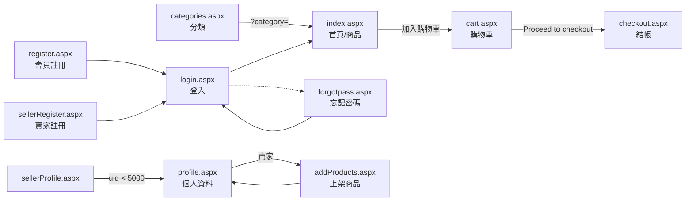
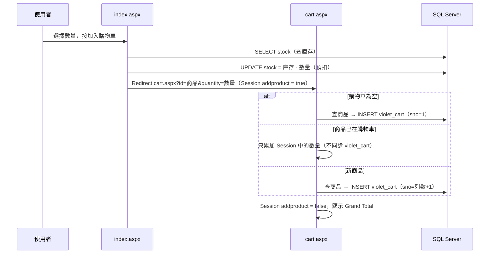

# Shopping Website — 電子商務網站（ASP.NET Web Forms）


以 **ASP.NET Web Forms（.NET Framework 4.7.2、C#）** 搭配 **SQL Server（ADO.NET）** 開發的教學用電子商務網站。
一般會員可以瀏覽、搜尋、排序商品並透過購物車下單；賣家可以上架商品、管理價格與庫存。

本 Repo 位於 [Jeff1121/Shopping-Website](https://github.com/Jeff1121/Shopping-Website)，源自
[DarylFernandes99/Shopping-Website](https://github.com/DarylFernandes99/Shopping-Website)，
並補上完整的繁體中文程式碼註解與文件（功能與原專案相同，未修改程式邏輯）。

> 🚀 **想直接跑起來？** 請看 [QuickStart.md](QuickStart.md)，內含資料庫建立腳本、連線字串設定、建置前必要修正與常見問題排除。

---

## 目錄

- [專案現況（請先閱讀）](#專案現況請先閱讀)
- [快速開始](#快速開始)
- [功能總覽](#功能總覽)
- [技術架構](#技術架構)
- [專案結構](#專案結構)
- [系統架構](#系統架構)
- [頁面說明](#頁面說明)
- [核心流程](#核心流程)
- [資料庫結構](#資料庫結構)
- [設定檔說明](#設定檔說明)
- [已知問題與限制](#已知問題與限制)
- [安全性說明](#安全性說明)
- [開發慣例](#開發慣例)
- [改進建議](#改進建議)
- [貢獻方式](#貢獻方式)
- [授權](#授權)

---

## 專案現況（請先閱讀）

| 項目 | 狀態 |
| --- | --- |
| 可否直接編譯 | ❌ 否。12 個後置程式碼檔案含佔位字串 `new SqlConnection(<enter your database connection>)`，`Web.config` 的連線字串為 `Add connection string here` |
| 缺漏檔案 | `Website/Properties/AssemblyInfo.cs`（專案檔有引用，缺少會建置失敗）、`Website/css/style.css`（僅影響外觀） |
| 版控現況 | Repo 沒有 `.gitignore`；`Website/obj/Debug/` 兩個快取檔已被簽入；部分已簽入圖片未列入 `Website.csproj` |
| 外部相依 | iTextSharp 以機器專屬路徑 `..\..\..\..\Files\OrderInvoice\itextsharp.dll` 參考，非 NuGet |
| 資料庫腳本 | `DbSql.sql` 已過時且有語法錯誤，請改用 [QuickStart.md](QuickStart.md#3-建立資料庫) 中的腳本 |
| 自動化測試 / CI / Lint | 無 |
| 執行平台 | 僅限 Windows（.NET Framework + IIS / IIS Express） |
| 安全性 | 僅適合學習用途：密碼明碼儲存、多處 SQL 字串串接（SQL Injection 風險），詳見[安全性說明](#安全性說明) |

---

## 快速開始

完整步驟（含資料庫腳本、各種連線字串範例、疑難排解）請見 [QuickStart.md](QuickStart.md)。摘要如下：

1. 準備 Windows、Visual Studio 2019+（ASP.NET 與網頁程式開發工作負載）、.NET Framework 4.7.2、SQL Server。
2. 取得原始碼：

   ```bash
   git clone https://github.com/Jeff1121/Shopping-Website.git
   cd Shopping-Website
   ```

3. 以 [QuickStart.md 第 3 節](QuickStart.md#3-建立資料庫)的腳本建立 `website` 資料庫（**不要**執行 `DbSql.sql`）。
4. 在 `Website/Web.config` 設定 `cmpConnectionString`，並把 12 個後置程式碼檔案中的 `<enter your database connection>` 改為讀取該連線字串。
5. 補上 `Website/Properties/AssemblyInfo.cs`、修正 iTextSharp 參考（建議改用 NuGet `iTextSharp` 5.5.13.3）。
6. 開啟 `Website.sln`，建置（`Ctrl+Shift+B`）後按 `F5`，瀏覽器會開啟 `https://localhost:44337/index.aspx`。
7. 註冊帳號後，以 SQL 將 `uid` 改為大於 5000 即可測試賣家功能。

---

## 功能總覽

### 訪客（未登入）

- 瀏覽首頁商品清單（每次隨機排序）。
- 依價格排序（Random / Low to High / High to Low）。
- 以關鍵字搜尋商品（比對 `keywords` 欄位）。
- 依分類瀏覽商品（`categories.aspx` → `index.aspx?category=...`）。
- 瀏覽「關於我們」、「部落格」靜態頁面。
- 送出「聯絡我們」留言。
- 註冊一般會員、賣家帳號；登入；忘記密碼。

### 一般會員（已登入）

- 頁首顯示登出、個人資料、購物車圖示與購物車品項數徽章。
- 選擇數量（1～10，且不超過庫存）加入購物車；庫存為 0 時顯示「售完」並停用按鈕。
- 購物車：修改數量、移除品項、查看總金額（Grand Total）。
- 購物車同時存在 Session 與資料庫，下次登入會自動還原。
- 結帳：系統產生訂單編號與日期，按下「Place Order」後建立訂單（**無金流**）。
- 個人資料：檢視帳號資料；可修改電話、地址、國家、州、城市。
- 訂單歷史：檢視所有已下訂單，並以 PDF（`OrderInvoice.pdf`）下載。
- 忘記密碼：回答註冊時設定的安全問題後，透過 Gmail SMTP 將密碼寄到註冊信箱。

### 賣家（`uid` > 5000）

- 個人資料頁額外顯示「Add a Product」按鈕與「Products Sold on Website」商品清單。
- 上架商品：名稱、價格、分類、關鍵字、圖片（僅 jpg / jpeg / png）。
- 商品清單可直接編輯價格、庫存、關鍵字，或刪除商品。

> 角色判斷完全依靠 `violet_user_login.uid` 的數值範圍，沒有獨立的權限機制，詳見[角色判斷](#角色判斷uid)。

---

## 技術架構

| 分類 | 技術 | 說明 |
| --- | --- | --- |
| Web 框架 | ASP.NET Web Forms | 每頁由 `.aspx` 標記 + `.aspx.cs` 後置程式碼 + `.aspx.designer.cs` 組成 |
| 語言 / 執行環境 | C#、.NET Framework 4.7.2 | 命名空間統一為 `Website` |
| 編譯器 | Microsoft.CodeDom.Providers.DotNetCompilerPlatform 2.0.1 | Roslyn，已簽入 `packages/` |
| 資料存取 | ADO.NET | `SqlConnection` / `SqlCommand` / `SqlDataAdapter` 與 `asp:SqlDataSource` 並存 |
| 資料庫 | Microsoft SQL Server | 所有資料表以 `violet_` 為前綴 |
| PDF | iTextSharp（`HTMLWorker`） | 將訂單歷史面板轉成 A4 PDF |
| 郵件 | `System.Net.Mail.SmtpClient` | Gmail SMTP（`smtp.gmail.com:587`，SSL） |
| 前端 | HTML、CSS（inline 與頁內 `<style>`） | 大量絕對定位排版；未使用 JavaScript 框架 |
| 驗證 | Web Forms 驗證控制項 | `RequiredFieldValidator`、`RegularExpressionValidator`、`CompareValidator`；已關閉 Unobtrusive 模式 |
| 開發工具 | Visual Studio 2019+、IIS Express | 預設網址 `https://localhost:44337/`，起始頁 `index.aspx` |

---

## 專案結構

```text
Shopping-Website/
├── .github/
│   └── copilot-instructions.md     # 給 AI 程式助理的專案說明
├── DbSql.sql                       # 原始資料庫腳本（已過時，僅供參考）
├── LICENSE                         # MIT 授權
├── QuickStart.md                   # 安裝與啟動指南
├── README.md                       # 本文件
├── Website.sln                     # Visual Studio 方案檔（VS 2019 格式）
├── packages/                       # 已簽入的 NuGet 套件（Roslyn 編譯器）
└── Website/                        # Web Forms 網站專案
    ├── index.aspx(.cs)             # 首頁 / 商品目錄、搜尋、排序、加入購物車
    ├── categories.aspx(.cs)        # 商品分類清單
    ├── cart.aspx(.cs)              # 購物車（修改數量、移除）
    ├── checkout.aspx(.cs)          # 結帳、建立訂單
    ├── login.aspx(.cs)             # 會員登入、還原購物車
    ├── register.aspx(.cs)          # 一般會員註冊、指派 uid
    ├── forgotpass.aspx(.cs)        # 忘記密碼（安全問題 + Email）
    ├── profile.aspx(.cs)           # 個人資料、訂單歷史與 PDF、賣家商品管理
    ├── addProducts.aspx(.cs)       # 賣家上架商品、上傳圖片
    ├── sellerRegister.aspx(.cs)    # 賣家註冊
    ├── sellerSignIn.aspx(.cs)      # 賣家登入（選單未連結）
    ├── sellerProfile.aspx(.cs)     # 賣家個人資料（功能未完成）
    ├── about.aspx(.cs)             # 關於我們（靜態）
    ├── blog.aspx(.cs)              # 部落格（靜態）
    ├── contact.aspx(.cs)           # 聯絡我們（寫入 violet_contact）
    ├── *.aspx.designer.cs          # 設計工具自動產生的控制項欄位宣告（已附繁中註解）
    ├── Web.config                  # 連線字串、編譯與驗證設定
    ├── Web.Debug.config            # Debug 組態轉換（僅範例）
    ├── Web.Release.config          # Release 組態轉換（移除 debug 屬性）
    ├── Website.csproj              # 專案檔（舊式格式，需手動登錄新檔案）
    ├── Website.csproj.user         # IIS Express 設定（SSL 埠 44337）
    ├── packages.config             # NuGet 套件清單
    ├── dummy.txt                   # 空白檔案（無用途）
    ├── obj/Debug/                  # 誤簽入的建置快取
    └── img/
        ├── categories/             # 分類圖片（desktop、laptop、pant、shirt）
        ├── icons/                  # 頁首與資訊列圖示（search、man、bag、delivery…）
        ├── logos/                  # 合作品牌 Logo
        ├── products/               # 商品圖片目錄；human.png 為圖片載入錯誤時的替代圖
        │   ├── apple.png           # 已簽入圖片，但未列入 Website.csproj
        │   ├── appol.png           # 已簽入圖片，但未列入 Website.csproj
        │   ├── arcade.png          # 已列入 Website.csproj
        │   ├── human.png           # 替代圖，已列入 Website.csproj
        │   ├── img1.png            # 已列入 Website.csproj
        │   ├── img2.png            # 已簽入圖片，但未列入 Website.csproj
        │   ├── printer.png         # 已列入 Website.csproj
        │   ├── watch.png           # 已列入 Website.csproj
        │   └── human99/
        │       └── laptop.png      # 賣家上傳目錄範例 products/<登入帳號>/；已簽入但未列入 Website.csproj
        ├── logo.png                # 網站 Logo
        ├── addtocart.png           # 加入購物車按鈕
        ├── sold.png                # 售完按鈕
        └── add.jpg、lookbok.jpg、mastercard.jpg、paypal.jpg
```

---

## 系統架構

### 頁面組成

- 每個頁面由三個檔案組成：`page.aspx`（標記）、`page.aspx.cs`（後置程式碼，類別名稱等於頁面名稱）、`page.aspx.designer.cs`（`runat="server"` 控制項的欄位宣告）。
- **沒有 Master Page**：頁首（Logo、主選單、登入/註冊選單、登出按鈕、搜尋/個人/購物車圖示、購物車徽章）、資訊列與頁尾在每個 `.aspx` 中各自複製一份；每個 `Page_Load` 也重複同一段「已登入就切換頁首顯示」的邏輯。修改共用 UI 時必須逐頁同步。
- 專案檔為舊式格式，新增頁面時必須在 `Website.csproj` 登錄 `<Content Include>` 與 `<Compile Include>`（含 `DependentUpon`）。

### 兩種資料存取方式

| 方式 | 使用位置 | 連線字串來源 |
| --- | --- | --- |
| 宣告式 `asp:SqlDataSource` | `index.aspx`（SqlDataSource1～5）、`categories.aspx`、`profile.aspx`（訂單歷史、賣家商品編輯/刪除） | `Web.config` 的 `cmpConnectionString` |
| 命令式 ADO.NET | 各 `.aspx.cs` 的 `con` 欄位或區域變數 | 程式碼內的佔位字串（需自行填入） |

命令式查詢混用參數化查詢與字串串接，詳見[安全性說明](#安全性說明)。

### 頁面導覽



### Session 狀態（跨頁隱性約定）

| Key | 型別 | 寫入位置 | 用途 |
| --- | --- | --- | --- |
| `Session["user"]` | string | `login`、`sellerSignIn` | 登入時輸入的文字（使用者名稱**或** Email）。查詢以 `WHERE username=@x OR email=@x` 解析；不為 null 即視為已登入；登出時設為 null |
| `Session["uname"]` | string | `login` | 使用者姓名（`violet_user_login.uname`），是購物車、訂單、商品中實際儲存的關聯鍵 |
| `Session["count"]` | `DataTable` | `login`、`cart`、`checkout` | 購物車內容，欄位 `sno, pimage, pname, price, quantity, total, uname`；列數即頁首徽章數字。`uname` 欄位在不同流程中語意不一致：從商品加入時放賣家姓名，登入還原時讀自 `violet_cart.uname`（買家姓名） |
| `Session["addproduct"]` | string | `index`、`cart` | `"true"` 表示剛從首頁按下加入購物車，`cart.aspx` 才會新增品項，處理後重設為 `"false"` |
| `Session["oldQuantity"]` | string | `cart` | 修改數量前的原數量，用於計算庫存差額 |
| `Session["count1"]` | — | 無 | `profile.aspx.cs` 誤讀此 key，導致該頁徽章永遠顯示 0 |

登出只清除 `Session["user"]`，其餘 Session 值會保留到 Session 逾時或下次登入覆寫。

---

## 頁面說明

| 頁面 | 用途 | 使用資料表 | 主要方法 / 事件 |
| --- | --- | --- | --- |
| `index.aspx` | 首頁商品目錄、排序、搜尋、分類篩選、加入購物車 | `violet_products` | `Page_Load`、`productsDisplay_ItemCommand`、`productsDisplay_ItemDataBound`、`btnSearch_Click`、`sortPrice_SelectedIndexChanged`、`searchIcon_Click` |
| `categories.aspx` | 列出所有分類 | `violet_categories` | `DataList1_ItemCommand` |
| `cart.aspx` | 購物車顯示、新增、修改、移除 | `violet_cart`、`violet_products`、`violet_user_login` | `filldata`、`GridView1_RowDeleting`、`GridView1_SelectedIndexChanged`、`modify`、`btnUpdate_Click`、`DropDownList1_SelectedIndexChanged`、`checkdesignid`、`updatequantity`、`savecartdetail`、`grandTotal` |
| `checkout.aspx` | 結帳、產生訂單編號、建立訂單 | `violet_order`、`violet_cart`、`violet_user_login` | `filldata`、`calculateOrderID`、`btnCheckout_Click`、`grandTotal` |
| `login.aspx` | 會員登入、還原購物車 | `violet_user_login`、`violet_cart` | `Submit_Click`、`fillsavedCart` |
| `register.aspx` | 一般會員註冊 | `violet_user_login` | `Submit_Click`、`generateUID` |
| `forgotpass.aspx` | 安全問題驗證後寄出密碼 | `violet_user_login` | `submit_Click`、`submitAns_Click` |
| `profile.aspx` | 個人資料、訂單歷史與 PDF、賣家商品管理 | `violet_user_login`、`violet_order`、`violet_products` | `Page_Load`、`Update_Click`、`Submit_Click`、`DownloadPDF`、`exportpdf`、`GridView1_RowDataBound`、`btnAddProduct_Click` |
| `addProducts.aspx` | 賣家上架商品與上傳圖片 | `violet_products`、`violet_user_login` | `Submit_Click`、`uploadImg` |
| `sellerRegister.aspx` | 賣家註冊（表單同會員註冊） | `violet_user_login` | `Submit_Click` |
| `sellerSignIn.aspx` | 賣家登入（只設定 `Session["user"]`） | `violet_user_login` | `Submit_Click` |
| `sellerProfile.aspx` | 賣家個人資料（更新功能未完成） | `violet_user_login` | `Page_Load`、`Update_Click`、`Submit_Click` |
| `about.aspx` / `blog.aspx` | 靜態內容 | — | `Page_Load`、`btnLogout_Click` |
| `contact.aspx` | 聯絡表單 | `violet_contact` | `Submit_Click` |

所有頁面都有 `btnLogout_Click`：清除 `Session["user"]` 後導向 `index.aspx`（`categories.aspx` 例外，導向 `login.aspx`）。

---

## 核心流程

### 登入與購物車還原

1. `login.aspx` 以 `username` 或 `email` 查出 `uname` 與 `password`，以**明碼**比對。
2. 成功後設定 `Session["uname"]`、`Session["user"]`，並呼叫 `fillsavedCart()`。
3. `fillsavedCart()` 從 `violet_cart` 讀出該使用者的品項，重建購物車 `DataTable`（`sno` 重新從 1 編號、`total` 重新計算）存入 `Session["count"]`。

### 加入購物車與庫存



- **修改數量**：按「Modify」→ 選新數量 →「Update」，庫存調整為 `stock + 舊數量 - 新數量`，同步更新 Session 與 `violet_cart`。
- **移除品項**：按「Remove Item(s)」，數量加回庫存，從 Session 與 `violet_cart` 刪除，剩餘品項 `sno` 重新編號為 1..N。
- 首頁數量下拉選單最多列出 10，且不超過目前庫存；購物車編輯面板則列出 1..庫存（無上限 10）。

### 結帳與訂單

1. `checkout.aspx` 顯示購物車明細、今天日期與訂單編號。
2. 訂單編號格式：`#` + 時 + 分 + 秒 + 日 + 月 + 年（皆未補零）+ 5 碼隨機英數字，例如 2026/9/29 22:35:12 產生 `#2235122992026aBc9x`。
3. 按「Place Order」後，購物車每一列以同一訂單編號寫入 `violet_order`，並刪除該使用者的 `violet_cart` 資料。
4. 付款方式僅為頁面文字，**沒有任何金流整合**。

### 訂單 PDF

`profile.aspx` 的訂單歷史面板 `panelOrder` 以 `RenderControl` 轉為 HTML，再交給 iTextSharp `HTMLWorker` 產生 A4 PDF，
以附件 `OrderInvoice.pdf` 下載。為此頁面設定了 `EnableEventValidation="false"`，並覆寫 `VerifyRenderingInServerForm`。

### 賣家上架與商品管理

1. `addProducts.aspx` 驗證副檔名（jpg / jpeg / png，區分大小寫），將圖片存到 `img/products/<Session["user"]>/`。
2. 資料庫中 `pimage` 儲存相對路徑，`uname` 儲存賣家姓名。
3. 分類選項寫死為 `Computer`、`Computer Accesories`，須與 `violet_categories.name` 一致。
4. `profile.aspx` 的 `SqlDataSource2` 提供賣家商品清單的編輯（價格、庫存、關鍵字）與刪除。

### 忘記密碼

1. 輸入使用者名稱或 Email → 顯示註冊時選的安全問題。
2. 答對後以 Gmail SMTP 將**原密碼**寄到註冊 Email，並導向登入頁。寄件帳密為程式中的佔位字串，需自行設定。

### 角色判斷（uid）

| uid 範圍 | 角色 | 來源 |
| --- | --- | --- |
| 1～4998 | 一般會員 | `register.aspx.cs` 的 `generateUID()` 隨機產生且不重複 |
| > 5000 | 賣家 | 程式沒有任何地方會指派，需手動以 SQL 設定 |

- `profile.aspx`：`uid > 5000` 顯示賣家區塊。
- `sellerProfile.aspx`：`uid < 5000` 導向 `profile.aspx`。
- 兩頁的邊界條件不一致：`uid = 5000` 可停留在 `sellerProfile.aspx`，但在 `profile.aspx` 不會顯示賣家區塊。測試賣家時請將 `uid` 設為 5001 以上。

---

## 資料庫結構

> `DbSql.sql` 與程式碼實際使用的結構不一致（拼字錯誤、缺表、缺欄位），可執行且與程式碼相符的完整腳本請見
> [QuickStart.md「建立資料庫」](QuickStart.md#3-建立資料庫)。以下為程式碼實際依賴的結構。

多處使用**位置式** `INSERT ... VALUES(...)`（未指定欄位名稱），因此欄位**順序**必須完全一致。

### `violet_user_login` — 會員與賣家帳號

| # | 欄位 | 型別 | 說明 |
| --- | --- | --- | --- |
| 1 | `uname` | VARCHAR(50) PK | 姓名；作為購物車、訂單、商品的關聯鍵 |
| 2 | `email` | VARCHAR(50) UNIQUE | Email，可用於登入 |
| 3 | `username` | VARCHAR(20) UNIQUE | 使用者名稱，可用於登入 |
| 4 | `password` | VARCHAR(20) | **明碼**密碼 |
| 5 | `phone` | DECIMAL(10,0) UNIQUE | 10 位數電話 |
| 6 | `dob` | DATE | 生日 |
| 7 | `country` | VARCHAR(20) | 國家 |
| 8 | `state` | VARCHAR(20) | 州 / 省 |
| 9 | `city` | VARCHAR(20) | 城市 |
| 10 | `gender` | VARCHAR(10) | Male / Female / Others |
| 11 | `address` | VARCHAR(500) | 地址 |
| 12 | `secq` | VARCHAR(100) | 安全問題 |
| 13 | `seca` | VARCHAR(20) | 安全問題答案 |
| 14 | `uid` | INT | 角色代碼（見[角色判斷](#角色判斷uid)）；`DbSql.sql` 缺少此欄 |

### `violet_products` — 商品

| 欄位 | 型別 | 說明 |
| --- | --- | --- |
| `pname` | VARCHAR(50) PK | 商品名稱；程式以名稱識別商品 |
| `price` | DECIMAL(20,2) | 單價 |
| `pimage` | VARCHAR(250) | 圖片相對路徑 |
| `category` | VARCHAR(50) | 分類名稱（原腳本 15 字元不足以容納 `Computer Accesories`） |
| `uname` | VARCHAR(50) | 賣家姓名（`DbSql.sql` 寫作 `sname`，與程式不符） |
| `keywords` | VARCHAR(500) | 搜尋關鍵字 |
| `stock` | INT | 庫存 |

### `violet_cart` — 購物車（位置式 INSERT，8 欄）

`uname`（買家）、`sno`、`pimage`、`pname`、`price`、`quantity`、`total`、`sname`（賣家）

### `violet_order` — 訂單（位置式 INSERT，6 欄）

`uname`、`pname`、`orderID`、`orderDate`（`ToShortDateString()` 字串）、`quantity`、`total`

### `violet_categories` — 分類

`name`（分類名稱）、`cimage`（分類圖片路徑）

### `violet_contact` — 聯絡留言（位置式 INSERT，3 欄）

`uname`、`email`、`message`

### `violet_seller_login`

僅存在於 `DbSql.sql`，**沒有任何程式碼使用**；賣家與會員同樣存放在 `violet_user_login`。

---

## 設定檔說明

| 檔案 | 設定 | 說明 |
| --- | --- | --- |
| `Web.config` | `connectionStrings/cmpConnectionString` | 供 `asp:SqlDataSource` 使用，需自行填入 |
| `Web.config` | `compilation debug="true" targetFramework="4.7.2"` | 開發模式編譯 |
| `Web.config` | `system.codedom` | 使用 Roslyn 編譯器（C# `/langversion:default`） |
| `Web.config` | `ValidationSettings:UnobtrusiveValidationMode=None` | 驗證控制項不需 jQuery |
| `Web.Release.config` | `RemoveAttributes(debug)` | 發行時移除 debug |
| `Website.csproj.user` | `IISExpressSSLPort=44337`、`StartPageUrl=index.aspx` | IIS Express 啟動設定 |
| `forgotpass.aspx.cs` | `"enter email id"`、`"enter password"` | Gmail SMTP 寄件帳密佔位字串 |

---

## 已知問題與限制

### 建置與環境

- 12 個 `<enter your database connection>` 佔位字串無法編譯。
- 缺少 `Properties/AssemblyInfo.cs`、`css/style.css`。
- iTextSharp 參考路徑為原作者本機路徑。
- `Website/obj/Debug/` 建置快取被簽入版控；Repo 沒有 `.gitignore`。

### 功能缺陷

| 位置 | 問題 |
| --- | --- |
| `sellerRegister.aspx.cs` | INSERT 只提供 13 個值，在含 `uid` 的 14 欄結構下會失敗；也不會指派賣家 uid |
| `addProducts.aspx.cs` | INSERT 只提供 6 個值（缺 `stock`），在含 `stock` 的結構下會失敗；未選檔案時 `Substring(1)` 會拋例外；未檢查登入或賣家身分 |
| `cart.aspx.cs` | 未經首頁直接開啟時 `Session["addproduct"]` 為 null → `NullReferenceException`；同商品重複加入只更新 Session，不同步 `violet_cart`；`availabledesignid` 為 `static`，所有使用者共用 |
| `checkout.aspx.cs` | 下單後未清空 `Session["count"]`，徽章仍顯示舊數量；未登入或購物車為空時按下單會拋例外 |
| `register.aspx.cs` | `generateUID()` 抽到重複 uid 時未關閉連線即 `continue`，下一輪 `Open()` 會拋例外 |
| `forgotpass.aspx.cs` | 帳號、密碼、答案存在 `static` 欄位，多人同時使用會互相覆蓋；查無帳號時未關閉連線 |
| `profile.aspx.cs` | 徽章讀取 `Session["count1"]`；`uid` 只在首次載入讀取，PostBack 後賣家區塊會消失；`Submit_Click` 以 `Response.Write` 輸出 SQL（除錯殘留）；刪除確認對話框掛在「Edit」按鈕上 |
| `sellerProfile.aspx.cs` | 更新/送出功能未實作；PostBack 後 `uid` 為 0 會被導向 `profile.aspx` |
| `sellerSignIn.aspx` | 選單沒有連結；登入後不設定 `Session["uname"]`、不還原購物車 |
| `login.aspx.cs` | 查無帳號時密碼為空字串，理論上空白密碼可通過比對（前端有必填驗證） |
| `index.aspx.cs` | 每個商品繫結時各查一次庫存（N+1 查詢）；搜尋按鈕的 null 判斷永遠成立 |
| `register.aspx` | 國家/州/城市的驗證器被註解，選 `Select` 也會被接受；州/城市選項為固定的印度地名 |

### 設計限制

- 無 Master Page，共用 UI 需逐頁修改。
- 以商品名稱（`pname`）作為識別，名稱不可重複。
- 庫存在「加入購物車」時就預扣，放棄購物車不會自動歸還。
- 排版使用大量絕對定位（針對約 1500px 寬的桌機螢幕），不支援響應式。
- 無金流、無訂單狀態追蹤、無管理後台。

---

## 安全性說明

本專案為教學作品，**不適合直接用於正式環境**。已知風險：

| 風險 | 說明 |
| --- | --- |
| SQL Injection | `cart`、`checkout`、`index`、`login`（`fillsavedCart`）、`profile` 等多處以字串串接 SQL，且部分值來自查詢字串（`?id=`） |
| 明碼密碼 | 密碼以明碼儲存、比對，忘記密碼功能還會以 Email 寄出原密碼 |
| 權限控管 | 頁面未檢查角色；任何人都能直接開啟 `addProducts.aspx`、修改 `?id=`/`?quantity=` |
| 檔案上傳 | 僅以副檔名檢查，使用原始檔名存檔，可能覆蓋既有檔案 |
| 機密資訊 | 連線字串、SMTP 帳密需寫在原始碼中 |
| 資訊洩漏 | `profile.aspx` 會把 SQL 語句輸出到頁面 |
| 共用狀態 | `static` 欄位跨使用者共用（`forgotpass`、`cart`） |

建議修正方向：全面改用參數化查詢、以雜湊（如 PBKDF2 / bcrypt）儲存密碼並改為重設密碼連結、
加入頁面權限檢查、上傳時重新命名檔案並驗證內容、將機密移到設定檔或環境變數。

---

## 開發慣例

- **新增頁面**：建立 `.aspx`、`.aspx.cs`、`.aspx.designer.cs` 三個檔案，並登錄到 `Website.csproj`；複製既有頁面的頁首/頁尾與 `Page_Load` 登入狀態邏輯。
- **新增伺服器控制項**：同步更新 `.aspx.designer.cs`（在 Visual Studio 設計工具中儲存即會自動產生）。
- **修改資料表**：因位置式 INSERT，調整欄位順序或數量時需同步修改對應的程式碼，並一併更新 `QuickStart.md` 與本文件的資料庫章節。
- **程式碼註解**：所有類別、方法、欄位皆以繁體中文 XML 文件註解（`/// <summary>`）說明；每個 `.aspx` 第二行以 `<%-- --%>` 說明頁面用途；設定檔（`Web.config`、`Website.csproj` 等）以 XML 註解說明。
- **designer 檔註解**：`.aspx.designer.cs` 的每個控制項欄位都有「型別「ID」：用途」格式的繁中註解。Visual Studio 重新產生此檔時會還原為英文預設註解，提交前請補回或還原。
- **機密資訊**：不要提交真實連線字串或 SMTP 密碼。

---

## 改進建議

> CI/CD（CodeQL 品質／安全掃描、SBOM、Azure App Service 部署、連線資訊環境變數化）的完整規劃見 [Plan.md](Plan.md)。

- 以 Master Page 或 User Control 抽出共用頁首/頁尾。
- 集中管理連線字串（`ConfigurationManager.ConnectionStrings`），並抽出資料存取層。
- 全面改用參數化查詢與 `using` 釋放連線。
- 密碼雜湊、重設密碼流程、角色授權。
- 修正位置式 INSERT 為指定欄位的 INSERT。
- 加入 `.gitignore`（排除 `bin/`、`obj/`、`packages/`）。
- 串接金流（如 Stripe、PayPal）、訂單狀態追蹤、管理後台。
- 響應式版面。
- 遷移到 ASP.NET Core（Razor Pages / MVC）以支援跨平台。

---

## 貢獻方式

1. Fork 本 Repo。
2. 建立功能分支：`git checkout -b feature/功能名稱`。
3. 提交變更：`git commit -m "說明變更內容"`。
4. 推送分支：`git push origin feature/功能名稱`。
5. 建立 Pull Request。

提交前請確認：遵循 C# 命名慣例、資料庫變更已同步更新文件、未提交任何機密資訊。

---

## 授權

本專案採用 **MIT 授權**，詳見 [LICENSE](LICENSE)（Copyright (c) 2021 Daryl Fernandes）。

- ✅ 可商業使用、修改、散布、私人使用
- ❌ 不提供任何擔保，作者不負任何責任
